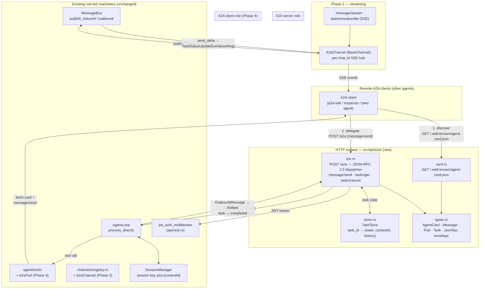
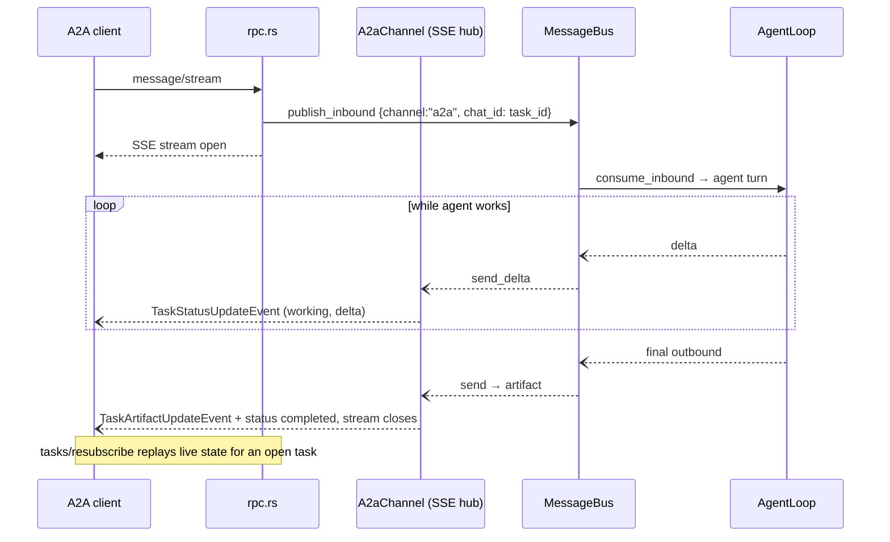

# A2A protocol support

Expose rust-bot to the agent ecosystem: other agents discover it via an **Agent Card** and delegate tasks over **JSON-RPC 2.0**; rust-bot can also call other agents via a client tool. Spec pinned to A2A **v0.3.x+ JSON-RPC binding** (serve both `agent-card.json` and legacy `agent.json` paths during transition).

No new dependencies — axum (SSE built in), serde, tokio cover the whole surface. Hand-roll rather than depend on a fast-moving community crate; the spec's proto/JSON schemas are small.

## Core architecture

Two thin layers on existing machinery: an **HTTP surface** in `src/api/a2a/` (protocol translation: JSON-RPC ⇄ rust-bot types) and an **agent bridge** (`AgentLoop.process_direct` in Phase 1, a real `BaseChannel` in Phase 2).



### Phase 1 request flow (`message/send`, blocking)

```mermaid
sequenceDiagram
    participant C as A2A client
    participant R as rpc.rs (POST /a2a)
    participant S as TaskStore
    participant A as AgentLoop

    C->>R: JSON-RPC message/send<br/>{message: TextParts, contextId?}
    R->>R: JWT already validated by middleware
    R->>S: create task (submitted → working)<br/>session = a2a:{contextId}
    R->>A: process_direct(content, "a2a", task_id, media)
    A-->>R: OutboundMessage (content + media)
    R->>S: artifact stored, task → completed
    R-->>C: Task {status: completed, artifacts: [TextPart]}
    Note over C,R: tasks/get polls state; tasks/cancel → cooperative flag
```

### Phase 2 streaming flow (`message/stream`, SSE)



## Method mapping

| JSON-RPC method | Phase | Implementation |
|---|---|---|
| `message/send` | 1 | `AgentLoop.process_direct(content, Some(session_id), Some("a2a"), Some(task_id), Some(media), …)` — same pattern as `chat_completions` (rest.rs:314) |
| `tasks/get` | 1 | `TaskStore` lookup + `historyLength` trimming |
| `tasks/cancel` | 1 | cooperative-cancel flag (crib from websocket `abort_turn`); non-terminal only |
| `message/stream` | 2 | `publish_inbound` + axum SSE via `A2aChannel` hub |
| `tasks/resubscribe` | 2 | attach SSE to a live task's hub |
| `tasks/list` | 3 | `TaskStore` scan with context filter |
| `input-required` state | 3 | agent loop must surface clarifications as a pauseable state |
| push notifications | 4+ | likely never — rust-bot is interactive-first; keep capability `false` |

## Data mapping (A2A ⇄ rust-bot)

| A2A | rust-bot |
|---|---|
| `contextId` | session key `a2a:{contextId}` → multi-turn memory via `SessionManager` |
| `taskId` | `TaskStore` key; doubles as `chat_id` |
| TextPart(s) | concatenated → `content` |
| FilePart (uri) | download to temp → `media` (reuse `materialize_image_urls` pattern) |
| DataPart | JSON-serialized → metadata |
| `OutboundMessage.content` | final Artifact TextPart; task → `completed` |
| outbound `media` | FilePart URIs on the artifact |
| `blocking: false` | return `submitted`, spawn turn with `tokio::spawn` writing state to store (Phase 3) |
| auth | existing `jwt_auth_middleware`; card declares `securitySchemes: {bearer: {type: http, scheme: bearer}}` |

## Error codes

Standard JSON-RPC: `-32700` parse, `-32600` invalid request, `-32601` method not found, `-32602` invalid params, `-32603` internal.
A2A: `-32000` server error, `-32001` task not found, `-32002` task not cancelable, `-32004` unsupported operation (e.g. message to terminal-state task), `-32005` content type not supported.
⚠️ Verify against the pinned spec version's proto before merging — codes are version-sensitive.

## Config sketch

```json
{
  "a2a": {
    "enabled": true,
    "publicUrl": "https://bot.example.com",
    "path": "/a2a",
    "card": {
      "name": "rust-bot",
      "description": "Personal agent: workspace, shell, web, tools",
      "skills": [{ "id": "web-research", "name": "Web research", "tags": ["search", "fetch"] }]
    },
    "capabilities": { "streaming": true, "pushNotifications": false }
  }
}
```

Nice touch: auto-derive `AgentSkill` entries from the skills loader (`agent/skills.rs`) — each SKILL.md becomes a discoverable skill with `id/name/description/tags`, so remote agents can route work intelligently.

## Client side (Phase 4)

`A2aTool` in `agent/tools/a2a.rs` (mirror the rmcp/MCP setup): `{ url, message, task_id? }` → fetch card → `message/send` → return artifact text to the model. MCP = tools; A2A = delegate to peers. Gate remote URLs through a `remoteAgents` allowlist in config and the same SSRF guards the web tools use (project already ships `ipnet`/`url`).

## Gotchas / decisions

1. **Terminal-state messages** → `-32004 UnsupportedOperation`.
2. **Concurrency**: serialize turns per session key — no two concurrent turns on one session.
3. **Don't tap `bus.consume_outbound()`** for streaming — it's single-consumer and owned by the channel manager; the `A2aChannel` hub avoids that fight.
4. **Spec versioning**: 0.2.x serves `agent.json`, 0.3+ `agent-card.json` — serve both paths.
5. **Mount points**: `create_api_server` (api/rest.rs ~:578) and the combined gateway server (`cli::commands::run_gateway`).
6. **CORS**: server-to-server — not needed on A2A routes.

## Testing

- Router-oneshot tests (pattern already in rest.rs's test module) for JSON-RPC happy/negative paths and task state transitions.
- Interop smoke test: official A2A Inspector or Python `a2a-sdk` sample client against the card.

## Suggested order

1. **Phase 1** (`types.rs`, `card.rs`, `store.rs`, `rpc.rs`, config, mount): `message/send`, `tasks/get`, `tasks/cancel` via `process_direct`, JWT-auth'd, card at both well-known paths — immediately interop-testable.
2. **Phase 2**: `A2aChannel` + SSE hub for `message/stream` / `tasks/resubscribe`.
3. **Phase 3**: `input-required` multi-turn, file artifacts both directions, `tasks/list`, `blocking: false`.
4. **Phase 4**: `A2aTool` client + remote-agent registry, extended card, push notifications.
