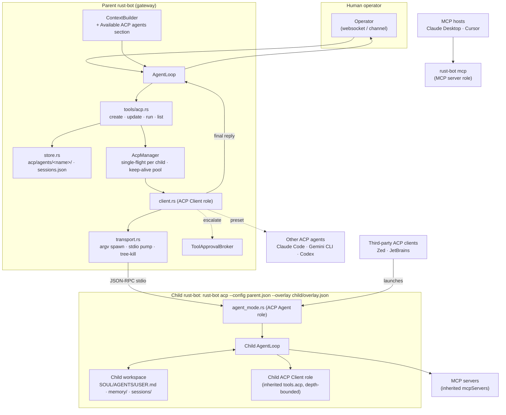

# ACP dynamic agent spawning

Enable the scenario: rust-bot **creates** an agent for a purpose (assembling a child workspace + config overlay — never synthesizing code), **launches** it over ACP, relays its work to the human operator, and on every later question **re-launches it with its own memory**.

## Requirements traceability

| Requirement | Guaranteed by |
|---|---|
| A rust-bot can create another rust-bot | `acp_create_agent` assembles `<ws>/acp/agents/<name>/`; default preset `rustbot` launches `rust-bot acp --config <parent> --overlay <child>/overlay.json` |
| The created rust-bot speaks ACP (Agent to its parent, Client to its own children) | Every rust-bot has both roles: `rust-bot acp` = Agent role; `tools.acp` is inherited through the overlay, so a child can create/run grandchildren (bounded by `maxDepth`) |
| Child inherits parent config, tweakable later | Parent config + RFC 7386 merge-patch overlay, applied at every child start (live inheritance; secrets never copied); `acp_update_agent` edits the overlay later |
| Parent may tweak SOUL.md / AGENTS.md / USER.md | Parent's bootstrap files copied into the child workspace at creation, then `soul` / `agents` / `user` overrides (replace or append) applied; editable later via `acp_update_agent` |
| Talk to other rust-bot instances and to other ACP clients/agents | Client role: any ACP agent via launch presets (rust-bot, Claude Code, Gemini CLI, Codex). Agent role: spec-complete enough (`authMethods: []`, `session/new` with `cwd` + `mcpServers`, `session/cancel`) for third-party ACP clients (Zed, JetBrains, …) to launch `rust-bot acp` directly |
| MCP as client and as agent | Client: existing `tools.mcpServers` (inherited by children) + per-session `mcpServers` passed in ACP `session/new`. Server: new `rust-bot mcp` stdio subcommand |
| Child memory kept separately over time | Child has its own workspace, so its own `memory/MEMORY.md`, history, dream edits, and `sessions/` — never shared with the parent |

## Terminology

In ACP, the process that is *launched* plays the **Agent** role and the launcher plays the **Client** role. So "the created rust-bot is an ACP client" is satisfied as: the child is an ACP **Agent** towards its parent, **and** (because it inherits `tools.acp`) an ACP **Client** towards any agents it creates itself. Both roles live in the same binary.

## Design decisions

1. **"Create" = assemble a workspace + overlay, never compile.** `acp_create_agent {name, purpose, preset?, soul?, agents?, user?, overlay?, cwd?}` creates:

   ```
   <parent-workspace>/acp/agents/code-review/
     agent.json      — {name, purpose, preset, createdAt, createdBy, depth}
     overlay.json    — JSON merge patch over the parent config
     SOUL.md         — parent copy, then override applied
     AGENTS.md       — parent copy, then override applied (e.g. "You are a code review specialist…")
     USER.md         — parent copy, then override applied
     TOOLS.md        — parent copy
     memory/         — empty; the child's own long-term memory
     sessions/       — the child's own session history
   ```

   The LLM supplies a preset *key* — never a raw command. `acp_create_agent` fails if `name` already exists (so step 6 cannot silently re-create and wipe memory); changes go through `acp_update_agent`.

2. **Config inheritance is live, via overlay.** The child starts with `rust-bot acp --config <parent config path> --overlay <child>/overlay.json`. `load_config_with_overlay` deep-merges the overlay onto the parent config (RFC 7386: objects merge, `null` deletes, arrays replace), then forces `agents.workspace = <child dir>`, then runs the normal validation. Consequences:
   - The child inherits provider, model, `mcpServers`, `tools.*`, `tools.acp` — including later edits to the parent config ("might be tweaked later on").
   - Secrets are read from the parent config at runtime; nothing is duplicated to disk.
   - Per-child tweaks (e.g. `{"agents": {"model": "…"}, "tools": {"exec": {"enabled": false}}}`) live only in `overlay.json`.
   - Channels are never started in `acp` mode regardless of inherited config.

3. **Memory isolation comes from the workspace, not from the ACP session.** `MemoryStore`, `SessionManager`, `ContextBuilder` and dream all key off the workspace path. A separate child workspace gives the child its own long-term memory that persists across ACP sessions, process restarts, and parent restarts (step 9). The ACP session (`session/load` / `session/resume`) only restores the *conversation* thread.

4. **Session scope.** `tools.acp.sessionScope`:
   - `perParentSession` (default): one ACP session per `(agentName, parentSessionKey)`, so two operators chatting with the parent do not see each other's threads in the child; long-term memory is still shared inside the child.
   - `shared`: one ACP session per agent.
   Worker side maps ACP `sessionId` → session key `acp:<sessionId>` in the child's `SessionManager`.

5. **Every rust-bot is dual-role, depth-bounded.** `tools.acp.maxDepth` (default 2) and env `RUST_BOT_ACP_DEPTH` (set by the transport on spawn, incremented per level). ACP tools are hidden from `tools_for_session` when `depth >= maxDepth`. A child's own children live under *its* workspace (`<child>/acp/agents/…`), so the tree is also visible on disk.

6. **Synchronous-first delivery (steps 3–4, 7–8).** `acp_run_agent` blocks on the turn (bounded by `timeoutSecs`) and returns the final reply + bounded activity tail as the tool result; the supervisor's AgentLoop then answers the operator via the normal channel reply path. Later: long-running turns announce via `MessageBus` (`SubagentManager::announce_result` idiom).

7. **Routing follow-ups to the same agent (steps 5–6, 9).** The supervisor system prompt gets an "Available ACP agents" section (name + purpose), so the LLM calls `acp_run_agent` for coding questions instead of answering itself or creating a duplicate. Optional later: a `/delegate <agent>` command that forwards every operator message in that chat to the agent without an LLM routing decision.

8. **Continuity is capability-gated, not assumed.** After each `initialize`: `loadSession` → `session/load`; else `sessionCapabilities.resume` → `session/resume`; else `session/new` with a recap prepended. The client **discards `session/update` notifications emitted during `session/load` replay** so replayed history is not aggregated into the new reply. rust-bot workers always advertise `loadSession`.

9. **Correct direction for `fs/*` and permissions.** `fs/*` and `session/request_permission` are **Agent → Client** requests. The rust-bot worker uses its own local tools (confined by its overlay's tool policy) and only sends `fs/*` to the client when `clientCapabilities.fs` advertises it (useful when an editor client wants unsaved buffers). The supervisor answers these requests from `permissionPolicy`: read-only allowed, writes/terminal denied by default, `escalate` bridges to `ToolApprovalBroker`.

10. **Single-flight per child.** At most one live worker process per child workspace; concurrent prompts to the same child queue. Prevents two processes writing the same `sessions/` and `memory/` files.

11. **stdout is the protocol.** In `acp` (and `mcp`) mode, tracing and every `println!` path go to stderr / log file; a stray byte on stdout corrupts the JSON-RPC stream.

12. **MCP in both directions.**
    - *MCP client:* existing `tools.mcpServers` (inherited through the overlay) plus per-session `mcpServers` from ACP `session/new` (stdio required by ACP; HTTP/SSE only if advertised in `mcpCapabilities`). When the parent launches a rust-bot child it passes `mcpServers: []`, because the child already inherits them through config (no double connection).
    - *MCP server:* `rust-bot mcp` exposes `rust_bot_chat {message, sessionKey?}` (one `process_direct` turn) and, when `tools.acp.enabled`, `acp_list_agents` / `acp_run_agent`. Any MCP host (Claude Desktop, Cursor, another rust-bot via `mcpServers`) can use rust-bot and its child agents as tools. Works with `--overlay`, so an individual child can be exposed as an MCP server too.

13. **ACP complements A2A.** ACP (stdio) = parent launches the peer. Talking to an *already running*, networked rust-bot is A2A (`a2a_protocol.plan.md`). No shared transport code beyond the JSON-RPC envelope.

## Core architecture



## Scenario flow (the 9 steps)

```mermaid
sequenceDiagram
    participant OP as Operator
    participant AL as Parent AgentLoop
    participant T as acp tools
    participant S as store.rs
    participant C as AcpClient
    participant W as Child rust-bot (rust-bot acp)

    Note over OP,W: Step 1 — create (agent did not exist)
    OP->>AL: "review the rust-bot code"
    AL->>T: acp_create_agent {name:"code-review", purpose, agents:"You are a code review specialist…"}
    T->>S: create acp/agents/code-review/ — copy SOUL/AGENTS/USER.md, apply overrides, write overlay.json + agent.json
    T-->>AL: created

    Note over OP,W: Steps 2–4 — first run
    AL->>T: acp_run_agent {name:"code-review", prompt}
    T->>S: sessions.json lookup (code-review, parentSessionKey) → none
    T->>C: spawn rust-bot acp --config parent.json --overlay …/overlay.json (depth+1)
    C->>W: initialize → loadSession=true
    C->>W: session/new {cwd, mcpServers: []} → sessionId (persisted)
    C->>W: session/prompt
    W->>W: process_direct in child workspace (own memory, own tools)
    W-->>C: session/update stream + final reply (stopReason end_turn)
    C-->>T: aggregated reply + activity tail
    T-->>AL: tool result
    AL-->>OP: first answer (step 4)
    Note over C,W: worker killed after turn (default); child memory/ + sessions/ stay on disk

    Note over OP,W: Steps 5–8 — follow-up, same agent
    OP->>AL: another coding question
    Note over AL: system prompt lists "code-review" → LLM routes to it
    AL->>T: acp_run_agent {name:"code-review", prompt}
    T->>S: sessionId found
    T->>C: spawn + initialize
    C->>W: session/load {sessionId} (replayed updates discarded by client)
    C->>W: session/prompt {follow-up}
    W-->>C: updates + final reply
    C-->>T: aggregated reply
    T-->>AL: tool result
    AL-->>OP: second answer (step 8)

    Note over OP,W: Step 9 — repeat indefinitely; child's MEMORY.md / dream evolve in its own workspace
```

## Module layout

```
src/agent/acp/
  mod.rs            — module wiring, AcpManager (single-flight, keep-alive pool, depth)
  types.rs          — JSON-RPC 2.0 envelope + ACP v1 subset (hand-rolled serde)
  agent_mode.rs     — ACP Agent role: stdio loop wrapping AgentLoop.process_direct
  transport.rs      — ChildTransport: spawn, pumps, correlation, tree-kill
  client.rs         — AcpClient: handshake, capability gate, turns, request routing
  store.rs          — ChildAgentStore + SessionRegistry
src/agent/tools/acp.rs — create / update / run / list tools
src/mcp_server/     — MCP server role (stdio): initialize, tools/list, tools/call
src/config/loader.rs — load_config_with_overlay (RFC 7386 merge patch)
src/cli/commands.rs  — Acp(AcpArgs) and Mcp(McpArgs) subcommands (headless, stdout = protocol)
```

## Config sketch (`config.json`)

```json
{
  "tools": {
    "acp": {
      "enabled": true,
      "maxDepth": 2,
      "allowDynamicAgents": true,
      "defaultTimeoutSecs": 600,
      "keepAliveSecs": 0,
      "permissionPolicy": "auto-approve-read",
      "sessionScope": "perParentSession",
      "launchPresets": {
        "rustbot": { "command": ["C:/development/onepoint/rust-bot/target/release/rust-bot.exe", "acp"] },
        "claude":  { "command": ["npx", "-y", "@agentclientprotocol/claude-agent-acp"] },
        "gemini":  { "command": ["gemini", "--experimental-acp"] }
      }
    }
  }
}
```

For the `rustbot` preset, the transport appends `--config <parent config path> --overlay <child>/overlay.json`. If `command[0]` is omitted or `"self"`, it uses `std::env::current_exe()`. External presets receive the child dir as `cwd` and the child's `AGENTS.md` content as the first prompt preamble (they have no overlay concept).

Example child `overlay.json` for a read-only reviewer:

```json
{
  "tools": { "exec": { "enabled": false } },
  "agents": { "restrictToWorkspace": true }
}
```

## Implementation phases

**Phase 1 — protocol core (types, transport, client).** As above; agent→client requests surface as enum events routed to handlers; stderr ring buffer for failure reports.

**Phase 2 — config overlay + child store.** `load_config_with_overlay`, `ChildAgentStore` (layout, bootstrap copy + overrides, `agent.json`), `SessionRegistry`. Unit tests for merge semantics (nested merge, `null` delete, array replace, forced workspace).

**Phase 3 — ACP Agent role (`rust-bot acp`).** Headless startup; stdout hygiene; initialize/authenticate/session/*; per-session MCP connections from `mcpServers`; `session/load` replay from the child `SessionManager`; `session/cancel`. Manually verify interop by registering `rust-bot acp` as a custom agent server in Zed.

**Phase 4 — tools, context, concurrency.** `acp_create_agent` / `acp_update_agent` / `acp_run_agent` / `acp_list_agents`; "Available ACP agents" system-prompt section; `AcpManager` single-flight; depth gating.

**Phase 5 — permissions + lifecycle.** Policy table (decision 9); `ToolApprovalBroker` escalation; keep-alive pool + reaper; tree-kill.

**Phase 6 — MCP server role (`rust-bot mcp`).** stdio MCP server exposing `rust_bot_chat` + ACP tools; same stdout hygiene; reuses `process_direct`.

## Security notes

- Spawn is code execution: dynamic agents only reference **preset keys**; argv arrays only; `cwd` must resolve inside the workspace (or explicit allowlist).
- Overlays may only *narrow* security-relevant settings relative to the parent (tool enablement, `restrictToWorkspace`, `maxDepth`); `acp_create_agent` / `acp_update_agent` reject overlays that widen them.
- Child tool policy lives in its overlay — a code-review child can be read-only, so a compromised child cannot mutate the host.
- Agent replies are untrusted tool-result content — plain text, never executed.
- Worker env is minimal (PATH, `RUST_BOT_ACP_DEPTH`, provider env vars actually referenced by config) — not the full supervisor env.
- `acp_create_agent` under `escalate` policy requires operator approval before first run.

## Windows notes

- `rustbot` preset spawns `rust-bot.exe` (absolute path or `current_exe()`) as an argv array — no shell, no `.cmd` shims.
- Node-based presets (`npx`/`uvx`) are `.cmd` shims — spawn via `cmd /C` or resolve `npx.cmd`, same as the MCP stdio transport. Never applies to `rustbot`.
- Tree-kill via `taskkill /PID <pid> /T /F`.
- UTF-8 on pipes; argv via `OsStr` lists (paths contain spaces).

## Test plan

- **Overlay merge:** nested merge, `null` delete, array replace, forced `agents.workspace`, security-widening overlay rejected.
- **Child store:** bootstrap files copied then overridden; `acp_create_agent` on an existing name fails; `acp_update_agent` edits persist.
- **Mock ACP agent** (`tests/acp_mock_agent.rs` binary): capability gating (no `loadSession` → client MUST NOT call it), permission deny, replay updates discarded, tree-kill leaves no orphans.
- **Real `rust-bot acp` with mock provider:** prompt happy path, `session/load` replay, `session/cancel`, stdout contains only JSON-RPC frames.
- **Memory isolation:** after a child turn, the child's `memory/` and `sessions/` change; the parent's do not.
- **Depth:** at `maxDepth` the ACP tools are absent from the child's tool list.
- **End-to-end 9-step scenario:** create → run → operator reply → follow-up routed to the same agent → relaunch with `session/load` → second reply references first-turn context → third question also succeeds; restart the parent between turns 2 and 3 and assert continuity survives.
- **MCP server:** `tools/list` includes `rust_bot_chat`; `tools/call` returns a reply; stdout hygiene.

## Out of scope

- ACP over HTTP/SSE remote transport (spec WIP; A2A covers networked peers).
- Supervision of parallel fan-out across many children (concurrency across *different* children works by design; orchestration logic is a later plan).
- Third-party engine presets ship as config examples only; rust-bot never installs engines.
