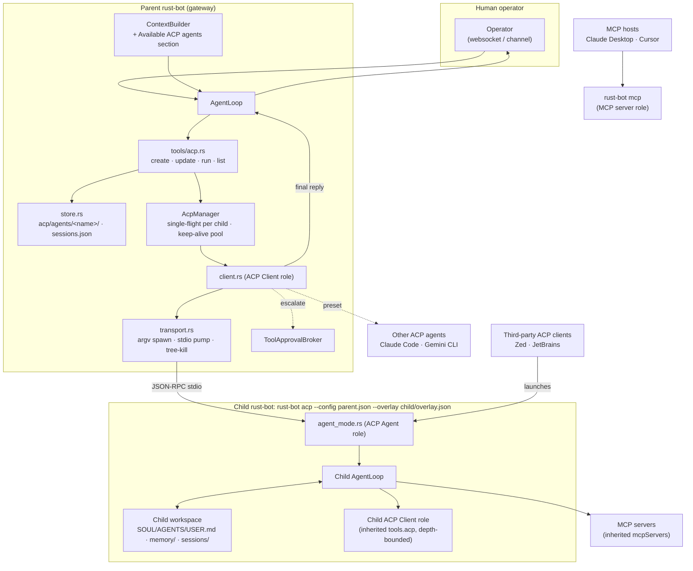

# ACP dynamic agent spawning

Enable the scenario: rust-bot **creates** an agent for a purpose (assembling a child workspace + config overlay — never synthesizing code), **launches** it over ACP, relays its work to the human operator, and on every later question **re-launches it with its own memory**.

## Requirements traceability

| Requirement | Guaranteed by |
|---|---|
| A rust-bot can create another rust-bot | `acp_create_agent` assembles `<ws>/acp/agents/<name>/`; default preset `rustbot` launches `rust-bot acp --config <parent> --overlay <child>/overlay.json` |
| The created rust-bot speaks ACP (Agent to its parent, Client to its own children) | Every rust-bot has both roles: `rust-bot acp` = Agent role; `tools.acp` is inherited through the overlay, so a child can create/run grandchildren (bounded by `maxDepth`) |
| Child inherits parent config, tweakable later | Parent config + RFC 7386 merge-patch overlay, applied at every child start (live inheritance; secrets never copied); `acp_update_agent` edits the overlay later |
| Parent may tweak SOUL.md / AGENTS.md / USER.md | Parent's bootstrap files copied into the child workspace at creation, then `soul` / `agents` / `user` overrides (replace or append) applied; editable later via `acp_update_agent` |
| Talk to other rust-bot instances and to other ACP clients/agents | Client role: any ACP agent via launch presets (rust-bot, Claude Code, Gemini CLI). Agent role: spec-complete enough (`authMethods: []`, `session/new` with `cwd` + `mcpServers`, `session/cancel`) for third-party ACP clients (Zed, JetBrains, …) to launch `rust-bot acp` directly |
| MCP as client and as agent | Client: existing `tools.mcpServers` (inherited by children) + per-session `mcpServers` passed in ACP `session/new`. Server: new `rust-bot mcp` stdio subcommand |
| Child memory kept separately over time | Child has its own workspace, so its own `memory/MEMORY.md`, history, dream edits, and `sessions/`. A child's file tools can never read the parent's or other children's memory and sessions (its project scope may not be inside a rust-bot home, and homes inside it are denied subtrees, decision 1; shell needs to be disabled for the same guarantee); the parent, as supervisor, can read its children's files |

## Terminology

In ACP, the process that is *launched* plays the **Agent** role and the launcher plays the **Client** role. So "the created rust-bot is an ACP client" is satisfied as: the child is an ACP **Agent** towards its parent, **and** (because it inherits `tools.acp`) an ACP **Client** towards any agents it creates itself. Both roles live in the same binary.

## Design decisions

1. **"Create" = assemble a workspace + overlay, never compile.** `acp_create_agent {name, purpose, preset?, soul?, agents?, user?, overlay?, cwd?}` creates:

   ```
   <parent-workspace>/acp/agents/code-review/
     agent.json      — {name, purpose, preset, createdAt, createdBy, depth, cwd?, overrides: {soul?, agents?, user?}, resyncedAt?}
     overlay.json    — JSON merge patch over the parent config
     SOUL.md         — parent copy, then override applied
     AGENTS.md       — parent copy, then override applied (e.g. "You are a code review specialist…")
     USER.md         — parent copy, then override applied
     TOOLS.md        — parent copy
     memory/         — empty; the child's own long-term memory
     sessions/       — the child's own session history
   ```

   **Bootstrap files are a snapshot, by design — unlike the config.** Config is inherited live (decision 2), but `SOUL.md`, `AGENTS.md`, `USER.md` and `TOOLS.md` are copied once at creation and then belong to the child. Live inheritance doesn't fit them: `MemoryStore` manages `SOUL.md` and `USER.md` in the workspace (`memory.rs:67-79`), so the child's Dream edits its own copies over time; reading them live from the parent would either lose the child's changes or overwrite the parent's.
   - **Overrides are persisted:** the `soul` / `agents` / `user` overrides given to `acp_create_agent` are stored in `agent.json` (`overrides`), so they can be re-applied later instead of being lost after creation.
   - **Explicit refresh:** `acp_update_agent {resyncFromParent: ["USER.md", …]}` re-copies the listed files from the parent, then re-applies the child's stored overrides for those files (same order as at creation), and records `resyncedAt`. Typical use: `USER.md` after the parent has learned more about the operator. The child's own Dream edits to a resynced file are replaced — that is the point of a resync, and the tool result says so.
   - **Drift is visible:** `acp_list_agents` reports, per child, whether its `USER.md` / `TOOLS.md` is older than the parent's (file mtime vs `resyncedAt` / `createdAt`), so the LLM or the operator can decide to resync.
   - `TOOLS.md` uses the same snapshot scheme for simplicity; it rarely changes.

   The LLM supplies a preset *key* — never a raw command. `acp_create_agent` fails if `name` already exists (so step 6 cannot silently re-create and wipe memory); changes go through `acp_update_agent`.

   **Agent home ≠ project directory.** The child directory above is the child's *home* (`agents.workspace`): memory, sessions and bootstrap files only. It is never the folder the child works on. The project the child works on is chosen per ACP session and reuses rust-bot's existing per-session project scope (`WorkspaceScope { project_path, access_mode }` in `src/security/workspace_access.rs`, bound per turn by `src/agent/workspace_context.rs`):
   - `session/new.cwd` becomes the child session's `WorkspaceScope.project_path` with `access_mode: restricted`, persisted in the session metadata, so `session/load` restores it. File tools resolve against and are confined to that folder via `current_tool_workspace()`; `MemoryStore` / `SessionManager` keep using the home.
   - The working directory is set per session, not per agent: the same child can work on different projects in different sessions. `acp_create_agent {cwd?}` stores an optional default `cwd` in `agent.json`, used when `acp_run_agent` does not pass one.
   - Narrowing rule: when the parent session is restricted, the `cwd` must resolve inside the parent's own current `project_path`; when the parent has full access, it may pass any existing absolute directory. Validation reuses `validate_workspace_scope_payload` (absolute, exists). A child can therefore never reach further than its parent.
   - **A child's project may never contain a rust-bot home.** Without a session scope, the project folder defaults to the workspace itself (`WorkspaceScopeResolver::default`, `workspace_access.rs:247`) — with the default setup `~/.rust-bot/workspace`. Passing that as the child's `cwd` would let the child's file tools read and edit the parent's `memory/MEMORY.md`, the parent's `sessions/` (other operators' conversations) and every sibling's home under `acp/agents/`. So:
     - **Rejected:** a `cwd` that **is, or lies inside,** a rust-bot home — the parent's workspace, any child's home (`acp/agents/<name>/`), or any directory recognised as a rust-bot workspace (has `memory/` + `sessions/`, or `acp/agents/`).
     - **Allowed, with the home blocked:** a `cwd` that **contains** a home. The onboarding default puts the workspace inside the project folder (`--workspace ./.rust-bot/workspace`, `commands.rs:242`), so rejecting such folders would block a common layout, including reviewing a repo that holds its own workspace. Instead, every rust-bot home found under the `cwd` is added to the child session's scope as a **denied subtree**: the file tools and the MCP `file://` resolver (`mcp_file_ref_resolver`, `agent_loop.rs:871-882`) refuse paths inside it. This needs a new `denied_roots: Vec<PathBuf>` on `ToolWorkspace` (`workspace_access.rs:205-219`), checked by the shared path resolution in the file tools.
     - **Limit:** shell is not path-confined without the exec sandbox, so a child *with* shell could still read a denied subtree. Children that must not see the parent's memory while working in a folder containing it should have shell disabled (as the reviewer overlay does); the tool result of `acp_run_agent` warns when a denied subtree exists and shell is enabled.
   - **No silent fallback to the parent's home:** if the parent has no separate project folder (its project defaults to its workspace) and `acp_run_agent` passes no `cwd` (and `agent.json` has no default), the call fails with a message asking for a project folder — e.g. the repository to review.
   - (The parent's `GitStore` never commits children's files: its `.gitignore` starts with `/*` and only re-includes its own tracked files, `gitstore.rs:415-435`.)
   - `restricted` still permits writes inside the project, and shell is not path-confined without the exec sandbox. Read-only children (e.g. a code reviewer) must also disable `write_file` / `edit_file` / shell in their overlay.

2. **Config inheritance is live, via overlay.** The child starts with `rust-bot acp --config <parent config path> --overlay <child>/overlay.json`. `load_config_with_overlay` validates the overlay against the allowlist (below), deep-merges it onto the parent config (RFC 7386: objects merge, `null` deletes, arrays replace), then forces `agents.workspace = <child dir>`, then runs the normal validation. Consequences:
   - The child inherits provider, model, `mcpServers`, `tools.*`, `tools.acp` — including later edits to the parent config ("might be tweaked later on").
   - Secrets are read from the parent config at runtime; nothing is duplicated to disk.
   - Per-child tweaks (e.g. `{"agents": {"model": "…"}, "tools": {"exec": {"enable": false}}}`) live only in `overlay.json`.
   - Channels are never started in `acp` mode regardless of inherited config.

   **Overlay allowlist — a child can never have more power than its parent.** The overlay is written by the LLM (`acp_create_agent` / `acp_update_agent`) and is a plain file on disk, so it is untrusted input. Without a check, an overlay could send the inherited API key to any URL (`providers.*.apiBase` — `create_provider_for` takes key, base and headers from the same entry, `factory.rs:100-156`), run arbitrary commands (`tools.mcpServers` entries; MCP children inherit the full env, `mcp/mod.rs:350-363`), or add spawn commands (`tools.acp.launchPresets`). A denylist would silently allow every config key added in future, so the check is an **allowlist**: every config path an overlay may set, each with a rule. Anything not listed is rejected with an error naming the path.

   | Rule | Meaning | Paths (final names verified against `schema.rs` at implementation) |
   |---|---|---|
   | **free** | any value; cannot grant power | `agents.model`; model preset name (must exist in the parent's presets); `agents.provider` (must name a provider already configured in the parent — it then uses the parent's key and base, never a new URL) |
   | **narrow-only** | may only be stricter than the parent's effective value | `tools.exec.enable` (true→false), `tools.restrictToWorkspace` (false→true), `tools.disabledTools` (superset of the parent's list), `tools.acp.enabled` (true→false), `tools.acp.maxDepth` (≤ parent), `tools.acp.allowDynamicAgents` (true→false), `tools.mcpServers.<name>` (`null` = drop an inherited server), `tools.mcpServers.<name>.enabledTools` (subset of the parent's) |
   | *(not listed)* | rejected | `providers.*` (apiBase, apiKey, extraHeaders), new `tools.mcpServers` entries or any of their command/args/env/url/headers, `tools.acp.launchPresets`, `channels.*`, cron, and everything else |

   - **Compare effective values, not patch text.** Narrow-only rules are checked on the merged value vs the parent's value. This also catches RFC 7386 `null` deletions: `"restrictToWorkspace": null` falls back to the default `false` and is rejected when the parent is `true`; `"disabledTools": null` drops the parent's list and is rejected.
   - **Unknown keys are rejected too.** A path missing from the config schema is not on the allowlist, so a typo such as `tools.exec.enabled` fails loudly instead of silently restricting nothing.
   - **Where it lives: in code, not in config.** A constant table in a new `src/config/overlay.rs`, next to `load_config_with_overlay`. Whatever holds the allowlist must not be editable by what it guards: in `overlay.json` the overlay could allow itself more, and in the parent `config.json` it would be one more setting that has to be kept safe. In code it is versioned, reviewed and unit-tested. (A parent-config extension such as `tools.acp.overlayExtraKeys` can be added later if needed; not in scope.)
   - **Enforced in two places, one function.** `validate_overlay(parent, overlay) -> Result<(), OverlayError>` is called by `acp_create_agent` / `acp_update_agent` (immediate, clear error for the LLM) and by `load_config_with_overlay` on every child start (the real guarantee — also catches a hand-edited or tampered `overlay.json`, which makes the child fail `initialize` with the error rather than start widened).
   - **Narrow-only keys combine as "strictest wins", not "overlay replaces".** Because inheritance is live, the parent may tighten a setting after the overlay was written (e.g. add a name to `disabledTools`, lower `maxDepth`). Plain RFC 7386 replacement would then let the older overlay value undo the parent's tightening. So for narrow-only paths the child's effective value is the stricter of parent and overlay: booleans AND/OR towards the safe side, `maxDepth` = min, `disabledTools` = union, `enabledTools` = intersection. A parent change can therefore only ever make its children stricter, never break or widen them. When the parent loosens, the child keeps its own stricter value. `validate_overlay` still rejects a widening overlay value when it is written, so the LLM gets feedback instead of a silently ignored setting.

   **As built in Milestone 2** (`config/overlay.rs`, `config/child_env.rs`):
   - **Table today:** `agents.model`, `agents.modelPreset`, `agents.provider` (free); `tools.exec.enable`, `tools.restrictToWorkspace`, `tools.disabledTools` (narrow-only); `tools.mcpServers.<name>` (drop with `null`) and its `enabledTools` (narrow-only). The `tools.acp.*` entries (`enabled`, `allowDynamicAgents`, `maxDepth`) are added in Milestone 3 together with `AcpConfig`; an overlay cannot reference a config section that does not exist yet.
   - **Keys are the canonical camelCase names only**; aliases (snake_case) are not accepted, so there is exactly one spelling to check. The error for a rejected setting names the exact path, e.g. `providers.openai.apiBase` or `tools.mcpServers.docs.env.A`.
   - **Two entry points, one table:** `validate_overlay` (write time: allowlist + "nothing looser than the parent *now*") and `load_config_with_overlay` (every start: allowlist, then strictest wins). A value that loosens the parent is an error when written but is *clamped, not fatal* at start, so a tampered file can never widen a child and a parent that tightens later can never break one.
   - **`--overlay` requires `--workspace`** (enforced by the command line): a child has its own home and must never share its parent's memory and sessions. The parent's workspace is never touched by a child (tested).
   - **Config-rewriting commands refuse in a child.** `/mcp-preset enable|disable` save the config to the global config path, which in a child is the *parent's* file — a child could give its parent a new MCP server. They now refuse when the process runs on an overlay (`overlay_is_active()`), with a message pointing at the parent.
   - **`tools.disabledTools`** is enforced in three places: at registration in `AgentLoop::new`, for MCP tools that connect later (`connect_mcp` skips them), and for the tools subagents get (`SubagentManager::build_tool_registry`).
   - **Child environment (decision 19), pure parts only:** `referenced_env_vars` (shares the loader's regex) and `child_environment` (base set + referenced variables + key variables of used providers; unset referenced variable → `MissingEnvVars` naming all of them; `RUST_BOT_ACP_DEPTH` set). Spawning with it comes with M3.

3. **Memory isolation comes from the workspace, not from the ACP session.** `MemoryStore`, `SessionManager`, `ContextBuilder` and dream all key off the workspace path. A separate child workspace gives the child its own long-term memory that persists across ACP sessions, process restarts, and parent restarts (step 9). The ACP session (`session/load` / `session/resume`) only restores the *conversation* thread.

4. **Session scope.** `tools.acp.sessionScope`:
   - `perParentSession` (default): one ACP session per `(agentName, parentSessionKey)`, so two operators chatting with the parent do not see each other's threads in the child; long-term memory is still shared inside the child.
   - `shared`: one ACP session per agent.
   Worker side maps ACP `sessionId` → session key `acp:<sessionId>` in the child's `SessionManager`.

5. **Every rust-bot is dual-role, depth-bounded.** `tools.acp.maxDepth` (default 2) and env `RUST_BOT_ACP_DEPTH` (set by the transport on spawn, incremented per level). ACP tools are hidden from `tools_for_session` when `depth >= maxDepth`. A child's own children live under *its* workspace (`<child>/acp/agents/…`), so the tree is also visible on disk.

6. **Synchronous-first delivery (steps 3–4, 7–8).** `acp_run_agent` blocks on the turn (bounded by `timeoutSecs`) and returns the final reply + bounded activity tail as the tool result; the supervisor's AgentLoop then answers the operator via the normal channel reply path. While it blocks, child activity is shown to the operator as progress, and stopping the parent's turn stops the child (decision 22). Later: long-running turns announce via `MessageBus` (`SubagentManager::announce_result` idiom).

7. **Routing follow-ups to the same agent (steps 5–6, 9).** The supervisor system prompt gets an "Available ACP agents" section (name + purpose), so the LLM calls `acp_run_agent` for coding questions instead of answering itself or creating a duplicate. Optional later: a `/delegate <agent>` command that forwards every operator message in that chat to the agent without an LLM routing decision.

8. **Continuity is capability-gated, not assumed.** After each `initialize`: `loadSession` → `session/load`; else `sessionCapabilities.resume` → `session/resume` (only if the pinned crate exposes it as stable — decision 18; rust-bot children never depend on it); else `session/new` with a recap prepended. The client **discards `session/update` notifications emitted during `session/load` replay** so replayed history is not aggregated into the new reply. rust-bot workers always advertise `loadSession`.

9. **Correct direction for `fs/*` and permissions.** `fs/*` and `session/request_permission` are **Agent → Client** requests. The rust-bot worker uses its own local tools (confined by its overlay's tool policy) and only sends `fs/*` to the client when `clientCapabilities.fs` advertises it (useful when an editor client wants unsaved buffers). The supervisor answers these requests from `permissionPolicy`: read-only allowed, writes/terminal denied by default, `escalate` bridges to `ToolApprovalBroker`.

   **Permissions fail closed — never "allow because nobody can answer".** Today approval exists only as the global `tools.confirmBeforeExecute` switch, covering every tool call with no per-tool list (`commands.rs:650-654`). When it is on, the CLI installs `CliAskHook`, which logs a warning and **runs the tools anyway** when stdin is not a terminal (`confirm_tools.rs:102-107`); the WebSocket hook only asks for channel `"websocket"`, other channels run unconfirmed. In `rust-bot acp` stdin is the protocol pipe, never a terminal, so reusing the CLI setup would silently disable approval in every child. Therefore:
   - **Child: the ACP hook replaces the CLI hook.** `rust-bot acp` never installs `CliAskHook`. The `AcpSessionHook` (decision 16) sends `session/request_permission` from its `before_execute_tools` and returns `ToolHookDecision::DenyCalls` for refused calls. Every ACP client must support this request, so it is always available.
   - **Which calls ask** (tool kinds from decision 16): `read` and `search` never ask; `edit`, `execute`, `fetch` and `other` always ask (`other` includes MCP tools, whose side effects rust-bot cannot know). With `confirmBeforeExecute: true`, every call asks — the setting keeps its current meaning.
   - **Fail closed:** a client error, a `cancelled` outcome, or no answer within a timeout **denies** the call. The runner already injects a synthetic result for `DenyCalls`, so the model sees "denied by client" and the transcript stays well-formed.
   - **Parent: `tools.acp.permissionPolicy`:**
     - `auto-approve-read` (default) — approve `read` / `search`, deny everything else.
     - `escalate` — forward to the human through the existing `ToolApprovalBroker`, on the channel and chat the parent's own turn came from (`acp_run_agent` carries them), so the WebSocket UI or CLI prompt shows it. If that channel cannot ask (e.g. CLI without a terminal, or a channel without an approval hook), **deny**.
     - `allow-all` — explicit opt-in only, never the default.
   - **`rust-bot mcp`:** no way to ask the caller in this plan, so with `confirmBeforeExecute: true` gated calls are **denied** instead of run. With it off, tools run as today — that is the user's own setting.
   - **Follow-up, out of scope:** `CliAskHook`'s "no terminal → run anyway" in the normal CLI (e.g. rust-bot used from a script) is arguably the same bug. Changing it affects existing CLI use, so it is noted here rather than changed by this plan.

10. **Single-flight per child — across processes, not just in memory.** At most one live worker process per child home; concurrent prompts to the same child queue. Prevents two processes writing the same `sessions/` and `memory/` files, which are rewritten in place without locking. Different children run in parallel freely.
    - **Why an in-memory lock is not enough:** several processes can reach the same child — the gateway, `rust-bot mcp` (which exposes `acp_run_agent`), a `rust-bot agent` CLI session, a second gateway on the same workspace, or a third-party ACP client launching `rust-bot acp --overlay` directly. Each has its own `AcpManager`.
    - **Cross-process lock, owned by the child:** on startup, `rust-bot acp` takes an exclusive OS file lock on `<child home>/.acp.lock` using `std::fs::File::lock` (stable since Rust 1.89; toolchain is 1.97, so no new dependency). The process that writes the files is the one that holds the lock. The OS releases it when the process exits, including on a crash or tree-kill, so there are no stale locks. Without `--overlay` (plain `rust-bot acp` launched by Zed etc.), the same lock is taken on its own workspace.
    - **Queueing instead of failing:** if the lock is held, the child waits for it (blocking lock in `spawn_blocking`) *before* answering `initialize`. The parent's `initialize` simply takes longer, bounded by `timeoutSecs`; EOF on stdin while waiting makes the child exit without touching any files. The lock holder's pid and start time are written into the lock file for diagnostics only (never used to decide ownership).
    - **In-process fast path stays:** `AcpManager` keeps its per-child async mutex so one parent process doesn't spawn a second, waiting worker for a child it is already running. The in-process lock is released only after the child process has exited (decision 13).
    - **Parent-side registry:** `<parent-workspace>/acp/sessions.json` is read-modify-written by every parent process. Guard each update with an exclusive lock on `<parent-workspace>/acp/sessions.json.lock` and save it atomically (below).

    **Atomic config saves.** Children re-read the parent's `config.json` on every start (decision 2). Today `save_config` truncates and rewrites it in place (`loader.rs:85`, plain `File::create`), and it is also called at runtime by `/mcp-preset enable|disable` (`builtin.rs:504,528`). `load_config` panics on invalid JSON, so a child starting mid-write can crash. Fix:
    - Add one shared helper, `utils::fs::write_atomic(path, bytes)`: write to a temp file in the same directory, `sync_all`, then `std::fs::rename` over the target (atomic on the same volume; replaces the target on Windows too). Retry the rename a few times on transient Windows errors (antivirus or indexer holding the file).
    - `save_config` and the `sessions.json` registry use it. It is also the helper for the follow-up in decision 13 (atomic `MemoryStore` / `SessionManager` writes), so that later change is a call-site swap, not new code.
    - In `acp` mode, a config that fails to parse is reported as a JSON-RPC error on `initialize` and a non-zero exit, not a panic.

    **As built in Milestone 2** (refinements of the text above):
    - **Startup order** (`cli/acp.rs`): claim stdout → start reading stdin in a background thread (`stdin_pump`, buffers the bytes and reports EOF) → load the config *read-only* → take the lock → only then create workspace files and build the runtime. Building the runtime writes to the workspace (templates, git store), so it must not happen before the lock is held. EOF while waiting exits 0 without touching anything; a free lock is taken even if stdin has already closed (`biased` select), so a client that sends its requests and closes stdin at once is still served.
    - **Bounded wait instead of an unbounded queue:** `--lock-wait-secs` (default 30). When it runs out, `initialize` fails with an error naming the holder's pid, instead of a client UI that hangs: a second client window or thread that ends up on the same workspace must explain itself. (Whether a given client starts one process per thread or shares one is client-specific and is checked in the manual Zed run.) A parent spawning a child passes a larger value, derived from `timeoutSecs`.
    - **Owner record in a sidecar:** on Windows a held lock is mandatory — other processes cannot read the locked file — so the holder records `{pid, since}` in `.acp.lock.owner`, never in the lock file. It is diagnostic only; the OS lock decides ownership.
    - **Scope:** only `rust-bot acp` takes the lock. The gateway and the CLI do not yet, so they can still run on a workspace that an `acp` process holds (noted in the README/limits, candidate for M3).
    - **Atomic writes** (`utils::fs::write_atomic`): temp file in the same folder → `sync_all` → rename, plus (a) permissions of an existing file kept on Unix (a config holding secrets may be `0600`), (b) a symlink target is written through instead of replaced, (c) the rename step is serialized inside a process and retried on `PermissionDenied` — on Windows several renames replacing one destination at once fail with "access denied" and keep colliding. Call sites: `save_config`, `SessionManager::save`, `MemoryStore` (`write_safe`, both cursor files, the history rewrite); appending to `history.jsonl` stays an append. A crash can leave a hidden `.name.pid.n.tmp` file behind; nothing cleans those yet.

11. **stdout is the protocol.** In `acp` (and `mcp`) mode, a stray byte on stdout corrupts the JSON-RPC stream. Today stdout is polluted in three ways: logging defaults to stdout (`init_runtime_logging`, `log.rs:60-64, 118-121`, and a failed log-file open falls back to stdout, `log.rs:136`); fixed startup prints (`println!("log file: …")`, `log.rs:127`; `println!("Using config: …")`, `commands.rs:1856`); and ~58 `println!`/`print!` calls across agent, provider, tool and config modules, some on runtime paths (e.g. `filesystem.rs`, `shell.rs`, `providers/base.rs`). Auditing them one by one is fragile — the next `println!` anyone adds would break the protocol again. Three layers:
    - **Logging to stderr in protocol mode.** `init_runtime_logging` gets a mode parameter. In protocol mode a stdout destination becomes stderr, a file destination stays, the "log file:" notice goes to stderr, and a failed file open falls back to stderr. `load_runtime_config` skips the "Using config" print in these modes.
    - **OS-level stdout redirect — the actual guarantee.** First thing at startup, before any other code runs, the protocol writer takes a duplicate of the real stdout handle for itself; then the process's standard output is pointed at stderr — Unix: `dup` + `dup2` via `libc` (already a Unix dependency); Windows: `SetStdHandle(STD_OUTPUT_HANDLE, <stderr handle>)` via `windows-sys` (new direct dependency, Windows-only). Every `println!` from rust-bot or any dependency then lands on stderr; only the JSON-RPC writer can reach the real stdout.
    - **Enforced by a test with logging on** (see test plan): a full turn with tool calls under `--logs` and `RUST_LOG=debug` must produce only JSON-RPC lines on stdout.

12. **MCP in both directions.**
    - *MCP client:* existing `tools.mcpServers` (inherited through the overlay) plus per-session `mcpServers` from ACP `session/new` (stdio required by ACP; HTTP/SSE only if advertised in `mcpCapabilities`). When the parent launches a rust-bot child it passes `mcpServers: []`, because the child already inherits them through config (no double connection).
    - *MCP server:* `rust-bot mcp` exposes `rust_bot_chat {message, sessionKey?}` (one `process_direct` turn) and, when `tools.acp.enabled`, `acp_list_agents` / `acp_run_agent`. Any MCP host (Claude Desktop, Cursor, another rust-bot via `mcpServers`) can use rust-bot and its child agents as tools. Works with `--overlay`, so an individual child can be exposed as an MCP server too.

13. **Graceful stop after each turn; tree-kill only as a fallback.** A child's memory work happens *after* the reply: consolidation is scheduled in the background after every turn (`schedule_background(maybe_consolidate_by_tokens)`, `agent_loop.rs:2036-2043`) and is only awaited by `close_mcp()`. Memory and session writes are not atomic (truncate + rewrite in place), so killing the child straight after the reply can truncate `MEMORY.md` or a session file. And Dream only runs as a gateway cron job (`commands.rs:1459-1489`), so without an explicit trigger a child's memory would never be dreamed over. Therefore:
    - **Signal:** after `acp_run_agent` has the final reply, the parent closes the child's stdin. ACP has no shutdown method; EOF on stdin is the standard signal for a stdio agent.
    - **Child on EOF (`agent_mode.rs`):** stop accepting requests → `close_mcp()` (drains background consolidation and closes MCP connections) → `dream.run()` → flush and exit 0.
    - **Dream on shutdown is cheap when idle:** `Dream::run` (`memory.rs:1202-1215`) returns without an LLM call or any write when there are no unprocessed history entries since its cursor. Entries only appear when consolidation archived something, so most short turns cost nothing extra.
    - **The operator is not kept waiting:** `acp_run_agent` returns the reply to the parent's AgentLoop immediately; the shutdown wait runs in the background.
    - **Single-flight covers shutdown:** the per-child lock (decision 10) is held until the child process has exited, so the next `acp_run_agent` for that child waits instead of starting a second process on the same files.
    - **Fallback:** if the child has not exited within `tools.acp.shutdownGraceSecs` (default 180, long enough for one Dream LLM call), or the turn itself exceeds `timeoutSecs`, the parent tree-kills (`taskkill /T /F`). Log it with the stderr ring buffer tail.
    - The keep-alive pool's idle reaper uses the same graceful path.
    - Third-party ACP clients (Zed, …) that simply close stdin get the same clean shutdown.
    - **Known residual risk:** a fallback tree-kill during a write can still truncate a file. Atomic writes (temp file + rename) in `MemoryStore::write_safe` and `SessionManager::save` would close that gap; out of scope for now, candidate follow-up.

14. **ACP complements A2A.**

15. **Cancellation reuses task abort, not a new token system.** `process_direct` (`agent_loop.rs:2257-2291`) takes no cancellation token and `tokio-util` is not a dependency. The existing `abort_session` (`agent_loop.rs:958-975`) aborts `JoinHandle`s in `active_tasks`, but only `run()` registers them, so a `process_direct` call cannot be stopped today. ACP requires that on `session/cancel` the agent stops and answers the pending `session/prompt` with `stopReason: "cancelled"`.
    - **Child (`agent_mode.rs`):** each `session/prompt` turn runs in its own spawned task; the `JoinHandle` is kept per ACP session. On `session/cancel`, abort that handle and answer the pending prompt with `stopReason: "cancelled"` — the same abort path channels already use.
    - **Nothing said so far is lost:** the turn's progress is saved as it goes through the existing mid-turn runtime checkpoints (`agent_loop.rs:1041-1047, 1139-1150`); an abort loses at most the work since the last checkpoint, and the next prompt continues from there. The turn task must go through the same checkpoint path that `run()` uses.
    - **Running shell commands die with the turn:** the shell tool wraps its process in `ChildGuard` (`shell.rs:155`) and waits in a polling loop that yields at each `await` (`shell.rs:170-181`); aborting the task drops the guard, which tree-kills the command. No change needed.
    - **Parent (`client.rs`):** when `acp_run_agent`'s `timeoutSecs` expires, send `session/cancel`; if the child has not answered within a short grace period, fall back to the shutdown / tree-kill path of decision 13.
    - **No duplicated tree-kill:** the ACP transport reuses `kill_process_tree_sync` (`shell.rs:520-531`), moved to a shared helper (e.g. `utils::process`), rather than writing its own `taskkill /T /F`.

16. **Structured tool events via an `AcpSessionHook` (ACP only).** ACP clients expect tool activity as structured `session/update` notifications — `tool_call` (id, title, kind, rawInput, locations, status) followed by `tool_call_update` (status, content). Today tool activity only leaves the loop as formatted text: `LoopHook::before_execute_tools` sends strings like `read src/main.rs` via `on_progress` as `ProgressKind::ToolHint` (`agent_loop.rs:214-233`) — no id, no arguments, no result. The data already exists in the hook system: `AgentHookContext` (`hook.rs:15-30`) carries `tool_calls` (`ToolCallRequest` with id, name, arguments), `tool_results` (filled before `after_iteration`, `runner.rs:1267, 1343`), `channel` and `chat_id`; and `AgentLoop::new` accepts extra hooks (`agent_loop.rs:303, 455`), which is how the CLI / WebSocket approval hooks are installed. So no change to the loop or the callbacks:
    - **`AcpSessionHook` in `agent_mode.rs`**, registered as an extra hook when the ACP agent loop is built.
    - **Routing:** each turn calls `process_direct` with channel `"acp"` and chat id = ACP `sessionId`; the hook uses `ctx.chat_id` to address the right session.
    - **`before_execute_tools`:** one `tool_call` per call — `toolCallId` = call id; `title` from the existing `format_tool_hints` (same wording as CLI / WebUI); `kind` mapped by tool name (`read_file` → `read`, `write_file` / `edit_file` → `edit`, `list_dir` / `glob` / `grep` → `search`, `shell` → `execute`, web tools → `fetch`, everything else → `other`); `rawInput` = arguments; `locations` = the path argument when present; `status: in_progress`.
    - **`after_iteration`:** one `tool_call_update` per call, matching `tool_results` to calls by `tool_call_id` — `status: completed | failed`, result text as `content`.
    - **Text and reasoning** keep using the existing callbacks, mapped to `agent_message_chunk` / `agent_thought_chunk`.
    - **Timing:** results are reported per iteration, not per tool — all tools of one model step complete together when the step ends. Per-tool completion would need a runner change; out of scope.
    - **Same hook handles permissions:** its `before_execute_tools` also sends `session/request_permission` and returns `ToolHookDecision::DenyCalls` for refused calls (see decision 9), exactly like the CLI / WebSocket approval hooks.
    - **Parent side:** `AcpClient` aggregates these updates into the activity tail returned by `acp_run_agent` and forwards them to the operator as progress during the turn (via the tool progress channel, decision 22).
    - **Not used by `rust-bot mcp`:** MCP `tools/call` returns one final result; there is no per-tool update stream in that mode.

17. **No `spawn` tool in `acp` / `mcp` mode.** The in-process subagent tool (`SpawnTool`, registered at `agent_loop.rs:412`) is not registered when rust-bot runs as `rust-bot acp` or `rust-bot mcp`. It does respect `tools.exec.enable` and `restrictToWorkspace` (`subagent.rs:264-293`), but inside a headless child it breaks four guarantees of this plan:
    - **No permission check:** subagents run with a logging-only hook (`SubagentHook`, `subagent.rs:51`), so the fail-closed approval of decision 9 would not apply to them.
    - **Wrong folder:** their file tools use `self.workspace` (`subagent.rs:264-274`) — in a child that is the child's *home*, not the session's project. The per-turn project scope (decision 1) is task-local and does not cross to the subagent's own thread and runtime (`subagent.rs:186-191`). The subagent could not see the project, but could write the child's `MEMORY.md`, `SOUL.md` and session files.
    - **Not stoppable:** `cancel_by_session` only joins the thread (`subagent.rs:517-520`), so neither `session/cancel` (decision 15) nor graceful shutdown (decision 13) can stop it.
    - **Result lost:** `announce_result` publishes a system message on the bus (`subagent.rs:434-484`) that only `run()` or the CLI listener consumes. An ACP child runs turns via `process_direct`, and the spawning turn has already returned.

    A child that needs help creates and runs its own children over ACP (bounded by `maxDepth`), which already provides permissions, the right project folder, cancellation, separate memory and a returned reply. Making `spawn` safe for headless mode (propagate the scope, approval hook, cancellation, result delivery) is out of scope. `spawn` stays unchanged in gateway and CLI modes.

18. **Use the official `agent-client-protocol` crate, not hand-rolled types.** Hand-rolling both roles of a spec that is still moving means chasing every spec change ourselves, and variants we did not list (content blocks, update kinds) become bugs. The crate is maintained by the spec authors and covers both roles with the same types.
    - **Pin:** `agent-client-protocol = "2.2"` (2.2.0, released 2026-09-18), protocol **v1 only**, no unstable features (`unstable_protocol_v2`, `unstable_session_fork` stay off).
    - **Contain churn with a thin adapter:** only `src/agent/acp/` imports crate types; the rest of rust-bot (tools, hooks, `AcpManager` callers) sees rust-bot's own types. The crate API has already changed substantially since `docs/acp/acp_peer.rs` was sketched (the 2.x API is organised by role — `Client`, `Agent`, `Proxy`, `Conductor` — and the sketch's `ClientSideConnection` style is not in the current docs), so a future change like that must stay inside one module.
    - **Runtime spike first (Phase 1):** the docs don't state whether the crate's futures are `Send`, and rust-bot's providers use non-`Send` futures (subagents already run on their own current-thread runtime for this reason, `subagent.rs:184-191`). The spike settles whether the connection runs on the main runtime or on a dedicated thread with a `LocalSet`, as the sketch does.
    - **Dependencies it adds:** `tokio-util` and `futures` plus some non-tokio async crates (`async-io`, `async-process`, `blocking`). No `anyhow` — the crate has its own `Error` type, mapped to rust-bot errors in the adapter.
    - **`session/resume` is optional:** it is not among the crate's documented stable v1 features, so the client only uses it if the pinned version exposes it as stable. rust-bot children always advertise `loadSession`, so continuity never depends on `resume`.
    - **The sketch:** `docs/acp/acp_peer.rs` is updated to the 2.x API during the spike, or deleted once real code exists.

19. **Child environment and `${VAR}` expansion.** `resolve_config_env_vars` (`loader.rs:99-112`) rewrites **every** string value containing `${VAR}` — not only provider keys; MCP `env` / `headers` rely on it (e.g. `${MCP_HEADERS_JWT}`) — and an unset variable is an error. A fixed "PATH + provider keys" environment would therefore make children fail at startup.
    - **Order in `load_config_with_overlay`:** load the **raw** parent config → `validate_overlay` + merge (decision 2) → `resolve_config_env_vars` on the merged result. The allowlist sees placeholders, not secrets; secrets are expanded only in memory inside the child and never written to disk.
    - **Env derived from the config:** before spawning, the parent scans the merged raw config for every `${VAR}` name, reusing the same regex as `resolve_config_env_vars` (shared, not copied), and passes exactly those variables, plus a base set:
      - rust-bot: `PATH`, `RUST_BOT_ACP_DEPTH`, `RUST_LOG`, `RUST_LOG_FILE`;
      - Windows: `SystemRoot`, `COMSPEC`, `PATHEXT`, `TEMP`, `TMP`, `USERPROFILE`, `APPDATA`;
      - Unix: `HOME`, `TMPDIR`, `LANG`.
      Without the OS essentials, `npx`, the shell tool and TLS certificate lookup break in hard-to-diagnose ways.
    - **Provider key variables** (`ProviderSpec.env_key`, e.g. `ANTHROPIC_API_KEY`) are passed only for providers the child's merged config actually uses.
    - **Missing variables fail in the parent:** if a referenced variable is not set in the parent either, `acp_run_agent` returns a clear error naming it instead of spawning a child that dies at startup.
    - External presets (Claude Code, Gemini CLI) get the base set plus the variables their preset declares; they don't read rust-bot's config.

20. **Absolute paths and the child's process working directory.** Several paths resolve against the directory the process was *started in*: the default `--config` `./.rust-bot/config.json` is stored without being made absolute (`commands.rs:101, 1854`), and a missing file silently yields `Config::default()` (`loader.rs:41-58`); `BUILTIN_SKILLS_DIR` is `current_dir().join("skills")` (`skills.rs:13-17`); and any path the user wrote as relative in `config.json` resolves against the cwd. `get_data_dir()` is the config file's parent folder (`paths.rs:9-19`), holding `logs/`, `media/`, `webui/` and `pairing.json`.
    - **Parent passes absolute paths:** `--config` and `--overlay` are canonicalised before spawning.
    - **Child process cwd = the parent's own process cwd**, so every remaining relative path (including built-in skills) resolves exactly as in the parent. This is the *process* working directory; the folder the child *works on* is the separate per-session project scope from decision 1 (`session/new.cwd`).
    - **`rust-bot acp` / `rust-bot mcp` make `--config` absolute at startup** (for third-party launchers such as Zed). In these modes a config path that doesn't exist is a startup error — a JSON-RPC error on `initialize` and a non-zero exit — instead of a silent fallback to `Config::default()`. Docs tell third-party clients to use an absolute `--config`.
    - **Shared data folder is intended:** children using the parent's config write logs and media into the parent's data folder. If `RUST_LOG_FILE` names one file, several processes append to it; acceptable for line-sized log records.

21. **MCP server built on rmcp's server side.** Production code only enables rmcp's client side (`Cargo.toml:40`: `client`, `transport-child-process`, `transport-io`, `transport-streamable-http-client-reqwest`, `reqwest-native-tls`); `server`, `macros` and `schemars` exist only in `[dev-dependencies]` for tests (`Cargo.toml:103-104`), so the production build has no MCP server code today.
    - **Cargo:** add `server`, `macros` and `schemars` to the production rmcp features and drop the now-redundant `[dev-dependencies]` rmcp entry. `transport-io` (stdio) is already in production — no new transport needed.
    - **Template:** `tests/agent/mcp_dummy_server.rs` already implements `ServerHandler` with `#[tool_router]` / `#[tool]`. `src/mcp_server/` follows it: tools `rust_bot_chat {message, sessionKey?}`, plus `acp_list_agents` / `acp_run_agent` when `tools.acp.enabled`, served over rmcp's stdio transport. No hand-rolled MCP protocol code.
    - **Not in scope:** a Cargo feature (e.g. `mcp-server`) to make the server optional in the binary; add only if build size becomes a concern.

22. **Progress while `acp_run_agent` waits, and no orphaned children.** `acp_run_agent` blocks the parent's turn for up to `defaultTimeoutSecs` (600 s), but tools have no progress channel — `Tool::execute` takes only its parameters and returns a string at the end (`tools/base.rs:67`) — so the operator would see nothing. And when the operator stops the parent's turn (`/stop`, `abort_session`), the parent task is aborted and the `acp_run_agent` future is simply dropped: the child keeps working on a turn nobody will read, holds its lock (decision 10), and the next run for that child waits behind it.
    - **Tool progress channel:** a task-local `ToolProgress` context (new `src/agent/tool_progress.rs`, same pattern as `workspace_context.rs` / `cron_context.rs`). The agent loop binds it per turn to that turn's existing `on_progress` callback; `report_progress(text)` sends a `ProgressKind::ToolHint`, which the CLI and WebUI already display. With no bound context it is a no-op, so existing tools are unaffected and other tools can adopt it later.
    - **Throttled child activity:** `acp_run_agent` reports each child `tool_call` as one line (e.g. `code-review › read src/main.rs`, title from decision 16) plus a heartbeat (`code-review › still working (2m 10s)`) about every 30 s while the child only streams text. Individual text / thought chunks are not forwarded.
    - **Cancel on drop:** `acp_run_agent` holds a guard for the running child turn. If the future is dropped before the reply arrives, the guard's `Drop` hands off to a background task that sends `session/cancel`, then the graceful stop of decision 13 (tree-kill after `shutdownGraceSecs`). The operator's `/stop` therefore also stops the child, and its lock is released.
    - **Unchanged:** decision 6's later option (announce long-running turns via `MessageBus`) remains for turns too long to wait for at all. ACP (stdio) = parent launches the peer. Talking to an *already running*, networked rust-bot is A2A (`a2a_protocol.plan.md`). No shared transport code beyond the JSON-RPC envelope.

## Core architecture


```mermaid
flowchart TB
    subgraph human["Human operator"]
        OP["Operator<br/>(websocket / channel)"]
    end

    subgraph supervisor["Parent rust-bot (gateway)"]
        AL["AgentLoop"]
        CTX["ContextBuilder<br/>+ Available ACP agents section"]
        TOOLS["tools/acp.rs<br/>create · update · run · list"]
        STORE["store.rs<br/>acp/agents/&lt;name&gt;/ · sessions.json"]
        MGR["AcpManager<br/>single-flight per child · keep-alive pool"]
        CLIENT["client.rs (ACP Client role)"]
        TRANS["transport.rs<br/>argv spawn · stdio pump · tree-kill"]
        TAB["ToolApprovalBroker"]
    end

    subgraph child["Child rust-bot: rust-bot acp --config parent.json --overlay child/overlay.json"]
        AM["agent_mode.rs (ACP Agent role)"]
        CAL["Child AgentLoop"]
        CWS["Child workspace<br/>SOUL/AGENTS/USER.md · memory/ · sessions/"]
        CCL["Child ACP Client role<br/>(inherited tools.acp, depth-bounded)"]
    end

    EXT["Other ACP agents<br/>Claude Code · Gemini CLI"]
    ZED["Third-party ACP clients<br/>Zed · JetBrains"]
    MCPS["MCP servers<br/>(inherited mcpServers)"]
    MCPH["MCP hosts<br/>Claude Desktop · Cursor"]
    MCPSRV["rust-bot mcp<br/>(MCP server role)"]

    OP --> AL --> TOOLS --> STORE
    CTX --> AL
    TOOLS --> MGR --> CLIENT --> TRANS
    TRANS -- "JSON-RPC stdio" --> AM
    AM --> CAL <--> CWS
    CAL --> CCL
    CAL --> MCPS
    CLIENT -. "preset" .-> EXT
    ZED -- "launches" --> AM
    MCPH --> MCPSRV
    CLIENT -. "escalate" .-> TAB
    CLIENT -- "final reply" --> AL --> OP
```

## Scenario flow (the 9 steps)

```mermaid
sequenceDiagram
    participant OP as Operator
    participant AL as Parent AgentLoop
    participant T as acp tools
    participant S as store.rs
    participant C as AcpClient
    participant W as Child rust-bot (rust-bot acp)

    Note over OP,W: Step 1 — create (agent did not exist)
    OP->>AL: "review the rust-bot code"
    AL->>T: acp_create_agent {name:"code-review", purpose, agents:"You are a code review specialist…"}
    T->>S: create acp/agents/code-review/ — copy SOUL/AGENTS/USER.md, apply overrides, write overlay.json + agent.json
    T-->>AL: created

    Note over OP,W: Steps 2–4 — first run
    AL->>T: acp_run_agent {name:"code-review", prompt}
    T->>S: sessions.json lookup (code-review, parentSessionKey) → none
    T->>C: spawn rust-bot acp --config parent.json --overlay …/overlay.json (depth+1)
    C->>W: initialize → loadSession=true
    C->>W: session/new {cwd, mcpServers: []} → sessionId (persisted)
    C->>W: session/prompt
    W->>W: process_direct in child workspace (own memory, own tools)
    W-->>C: session/update stream + final reply (stopReason end_turn)
    C-->>T: aggregated reply + activity tail
    T-->>AL: tool result
    AL-->>OP: first answer (step 4)
    C->>W: close stdin (EOF)
    W->>W: close_mcp() drains consolidation → dream.run() → exit 0
    Note over C,W: graceful stop after turn (default); tree-kill only after shutdownGraceSecs; child memory/ + sessions/ stay on disk

    Note over OP,W: Steps 5–8 — follow-up, same agent
    OP->>AL: another coding question
    Note over AL: system prompt lists "code-review" → LLM routes to it
    AL->>T: acp_run_agent {name:"code-review", prompt}
    T->>S: sessionId found
    T->>C: spawn + initialize
    C->>W: session/load {sessionId} (replayed updates discarded by client)
    C->>W: session/prompt {follow-up}
    W-->>C: updates + final reply
    C-->>T: aggregated reply
    T-->>AL: tool result
    AL-->>OP: second answer (step 8)

    Note over OP,W: Step 9 — repeat indefinitely; child's MEMORY.md / dream evolve in its own workspace
```

## Module layout

```
src/agent/acp/
  mod.rs            — module wiring, AcpManager (single-flight, keep-alive pool, depth)
  types.rs          — thin adapter over the agent-client-protocol crate (v1); the only module that imports crate types
  agent_mode.rs     — ACP Agent role: stdio loop wrapping AgentLoop.process_direct
  transport.rs      — ChildTransport: spawn, pumps, correlation, tree-kill
  client.rs         — AcpClient: handshake, capability gate, turns, request routing
  store.rs          — ChildAgentStore + SessionRegistry
src/agent/tools/acp.rs — create / update / run / list tools
src/mcp_server/     — MCP server role (stdio): initialize, tools/list, tools/call
src/config/overlay.rs — overlay allowlist, validate_overlay, load_config_with_overlay (RFC 7386 merge patch)
src/utils/fs.rs      — write_atomic (temp + fsync + rename)
src/cli/commands.rs  — Acp(AcpArgs) and Mcp(McpArgs) subcommands (headless, stdout = protocol)
```

## Config sketch (`config.json`)

```json
{
  "tools": {
    "acp": {
      "enabled": true,
      "maxDepth": 2,
      "allowDynamicAgents": true,
      "defaultTimeoutSecs": 600,
      "keepAliveSecs": 0,
      "shutdownGraceSecs": 180,
      "permissionPolicy": "auto-approve-read",   // | "escalate" | "allow-all"
      "sessionScope": "perParentSession",
      "launchPresets": {
        "rustbot": { "command": ["C:/development/onepoint/rust-bot/target/release/rust-bot.exe", "acp"] },
        "claude":  { "command": ["npx", "-y", "@agentclientprotocol/claude-agent-acp@<pinned-version>"] },
        "gemini":  { "command": ["gemini", "--acp"] }
      }
    }
  }
}
```

For the `rustbot` preset, the transport appends `--config <parent config path> --overlay <child>/overlay.json`, both canonicalised to absolute paths, and starts the child in the parent's own process working directory (decision 20). If `command[0]` is omitted or `"self"`, it uses `std::env::current_exe()`. External presets receive the session's project folder as `cwd` (decision 1 — never the child's home) and the child's `AGENTS.md` content as the first prompt preamble (they have no overlay concept; their own memory and settings are managed by the external agent itself). Permission requests from external agents are answered by the same fail-closed `permissionPolicy` (decision 9), and their environment is the base set plus the variables the preset declares (decision 19).

**External presets are examples, verified 2026-09-29 — re-check at setup time**, since these projects rename things:
- `claude`: `@agentclientprotocol/claude-agent-acp` (renamed from `@zed-industries/claude-agent-acp`), built on the official Claude Agent SDK — the user signs in through Claude Code itself, so it is the permitted way to use a Claude subscription. Pin a version: a bare `npx -y <package>` downloads whatever is newest on every run. The project also publishes prebuilt single-file binaries (Windows, macOS, Linux) that avoid `npx` entirely.
- `gemini`: `gemini --acp` (`--experimental-acp` is deprecated).
- Codex: no preset until its ACP adapter has been verified.

Example child `overlay.json` for a read-only reviewer:

```json
{
  "tools": {
    "exec": { "enable": false },
    "restrictToWorkspace": true,
    "disabledTools": ["write_file", "edit_file"]
  }
}
```

Key paths verified against `src/config/schema.rs`: shell is `tools.exec.enable` (not `enabled`), restrict-to-workspace is `tools.restrictToWorkspace` (not under `agents`). Unknown keys are silently ignored by the config parser (no `deny_unknown_fields`); the overlay allowlist (decision 2) rejects them so a wrong key fails loudly.

`tools.disabledTools` does **not exist yet**: there is currently no config switch for `write_file` / `edit_file`. Add it as part of this plan (a name list filtered out in `register_default_tools`, also applied to the `spawn` subagent registry for gateway / CLI mode — `spawn` itself is absent in `acp` / `mcp` mode, decision 17), otherwise a "read-only" child can still write inside its project scope.

`restrictToWorkspace: true` confines file tools to the session's project scope (`session/new.cwd`, see decision 1), not to the child's home.

## Implementation phases

**Phase 1 — protocol core (types, transport, client).** Starts with the crate spike (decision 18): add `agent-client-protocol = "2.2"`, confirm the runtime model against rust-bot's non-`Send` provider futures, update or retire `docs/acp/acp_peer.rs`. Then as above; agent→client requests surface as enum events routed to handlers; stderr ring buffer for failure reports.

**Phase 2 — config overlay + child store.** Overlay allowlist + `validate_overlay`, `load_config_with_overlay`, `write_atomic`, `ChildAgentStore` (layout, bootstrap copy + overrides, `agent.json`), `SessionRegistry`. Unit tests for merge semantics (nested merge, `null` delete, array replace, forced workspace).

**Phase 3 — ACP Agent role (`rust-bot acp`).** Headless startup; stdout hygiene (decision 11: protocol-mode logging, OS-level stdout redirect); initialize/authenticate/session/*; per-session MCP connections from `mcpServers`; `session/load` replay from the child `SessionManager`; `session/cancel` via task abort (decision 15). Manually verify interop by registering `rust-bot acp` as a custom agent server in Zed.

**Phase 4 — tools, context, concurrency.** `acp_create_agent` / `acp_update_agent` / `acp_run_agent` / `acp_list_agents`; "Available ACP agents" system-prompt section; `AcpManager` single-flight; depth gating.

**Phase 5 — permissions + lifecycle.** Policy table (decision 9); `ToolApprovalBroker` escalation; graceful stop on stdin EOF with Dream on shutdown (decision 13); keep-alive pool + reaper; tree-kill as fallback only.

**Phase 6 — MCP server role (`rust-bot mcp`).** Enable rmcp server features in production (decision 21); stdio MCP server on rmcp `ServerHandler` exposing `rust_bot_chat` + ACP tools; same stdout hygiene; reuses `process_direct`.

## Milestones

The phases above are the full plan. Work ships in milestones, each with a "done" definition that can be tested by hand before the next one starts.

### Milestone 1 — `rust-bot acp` as a standalone ACP agent (scenario 4: Zed, JetBrains, any ACP client)

**Goal:** an ACP client can launch `rust-bot acp --config <abs path>`, hold a conversation with it, see its tool activity, approve or deny its tool calls, cancel a turn, and close it cleanly. Nothing else exists yet: no children, no overlay, no client role, no MCP server.

**In scope (decisions used):**
- Crate spike and thin adapter (18): `agent-client-protocol = "2.2"`, v1 only; settles the runtime model against non-`Send` provider futures. `docs/acp/acp_peer.rs` is updated or removed.
- `Acp(AcpArgs)` subcommand, headless, with `--config` made absolute and a missing config as a startup error (20). No `--overlay` yet.
- stdout hygiene (11): protocol-mode logging to stderr, OS-level stdout redirect, protocol writer owns the real stdout.
- Agent role (`agent_mode.rs`): `initialize` (`loadSession: false`, `authMethods: []`), `session/new`, `session/prompt`, `session/cancel`. Each session maps to session key `acp:<sessionId>` in the configured workspace.
- Project scope (1): `session/new.cwd` becomes the session's `WorkspaceScope.project_path`, `restricted`; validated absolute and existing. Denied subtrees and the "no rust-bot home" rule wait for Milestone 3, where a parent hands out `cwd` values.
- `AcpSessionHook` (16): `tool_call` / `tool_call_update` with kinds, `rawInput`, `locations`; text and reasoning chunks from the existing callbacks.
- Fail-closed permissions (9): `session/request_permission` for `edit` / `execute` / `fetch` / `other`; deny on error, cancel or timeout; `CliAskHook` never installed. No `permissionPolicy` yet (that is the parent side).
- Cancellation (15): each turn in its own task, `session/cancel` aborts it, `stopReason: "cancelled"`. The shared tree-kill helper is moved to `utils::process`, only as far as the shell tool needs.
- No `spawn` tool in `acp` mode (17).
- Graceful stop on stdin EOF: drain background work via `close_mcp()`, `dream.run()`, exit 0 (13). No tree-kill fallback yet; that is a parent-side feature.

**Out of scope for M1** (later milestones): `session/load` and session replay, `--overlay` and overlay allowlist, child store, `.acp.lock` and atomic writes, ACP client role and `acp_*` tools, `tools.acp` config, MCP server, external presets, `ToolProgress`, `resolve_program`, `disabledTools`.

**Done means (all must pass):**

1. `cargo build` and `cargo test` pass; the existing test suite is unchanged and green.
2. **stdout stays clean.** `rust-bot acp --config <abs> --logs` with `RUST_LOG=debug`, given one `initialize` request on stdin and EOF, prints exactly one JSON-RPC line on stdout (`2> stderr.log` holds the logs). A deliberate `println!` in a test tool appears on stderr, never stdout.
3. **Automated conversation test** (`tests/acp_agent_test.rs`, mock LLM provider, the crate's client role as the test client): `initialize` → `session/new` → `session/prompt` with a tool call → receives `agent_message_chunk`, `tool_call` (id, kind, `rawInput`, `locations`), `tool_call_update` (`completed`) and `stopReason: end_turn`; a second prompt in the same session sees the first turn's context.
4. **Permissions:** in the same test, a `shell` call triggers `session/request_permission`; approve → runs; deny → the model gets "denied by client" and the transcript stays well-formed; client error, `cancelled` outcome and a timeout each deny; `read_file` never asks; `CliAskHook` is not installed.
5. **Cancel:** `session/cancel` during a long `shell` call → the prompt answers `stopReason: "cancelled"`, the shell process tree is gone, and the next prompt in that session works.
6. **Project scope:** with `cwd` = a temp project, `read_file` inside it works and outside it is refused; a relative or missing `cwd` is rejected.
7. **Clean stop:** closing stdin after a turn → the process exits 0 within a few seconds; `MEMORY.md` and the session file parse cleanly. `--config does-not-exist.json` → non-zero exit and a JSON-RPC error on `initialize`, not a start on defaults.
8. **`spawn` is absent** from the `acp` tool list and still present in the CLI tool list.
9. **Manual check in a real client (Zed):** register `rust-bot acp` as a custom agent server (absolute exe path and absolute `--config`; check Zed's current settings format), open a project folder, ask it to read a file → the tool call shows live; ask it to run a shell command → Zed asks for permission; deny → the agent reports the denial; stop a long command from Zed → it stops. Closing the thread ends the process (Task Manager).

**Estimated effort:** roughly 12–20 hours of agent working time, plus your review and the Zed check.

### Milestone 2 — sessions and safety plumbing (still standalone `rust-bot acp`)

**Goal:** everything a parent rust-bot will later rely on, built and testable while `rust-bot acp` is still launched by hand or by Zed: resumable sessions, no two processes on one workspace, no half-written files, and a config overlay that can never give a child more power than its parent. Still no ACP client role, child store, `acp_*` tools or MCP server.

**In scope (decisions used):**
- **Atomic writes (10):** `utils::fs::write_atomic` (temp file in the same folder, `sync_all`, rename over the target, bounded retry on transient Windows errors). Used by `save_config`, `SessionManager::save` and the `MemoryStore` file writes; appending to `history.jsonl` stays an append.
- **Cross-process lock (10):** `rust-bot acp` takes an exclusive OS lock (`std::fs::File::lock`) on `<workspace>/.acp.lock` before answering `initialize`, and keeps it until exit. If the lock is held it waits up to `--lock-wait-secs` (default 30), logging who holds it; then it answers `initialize` with a JSON-RPC error naming the holder's pid instead of hanging. EOF on stdin while waiting exits without touching any file. The holder's pid and start time are written into the lock file for diagnostics only. The OS releases the lock on any exit, including a kill.
- **`session/load` (8):** advertise `loadSession: true`; replay the stored conversation as `session/update` notifications (user text, agent text, tool calls with results), then answer; re-scope the session to the request's `cwd`; unknown session → JSON-RPC error. Replay never writes to the session history.
- **Overlay (2, 19, 20):** `rust-bot acp --overlay <file>`; `config/overlay.rs` with the code-level allowlist, `validate_overlay`, strictest-wins merge for narrow-only keys, raw-config → validate + merge → `${VAR}` expansion order; new `tools.disabledTools` setting (filtered in `register_default_tools`).
- **Child environment, pure parts (19):** collecting the `${VAR}` names of a raw config with the same regex the loader uses, and building the child environment (base set + referenced variables, provider key variables only for used providers, missing variable → error naming it). Not used for spawning until M3.

**Out of scope for M2:** ACP client role, `ChildAgentStore`, `acp_*` tools, `AcpManager` and its in-process lock, `sessions.json` registry, `ToolProgress`, `resolve_program`, MCP server, external presets, the gateway and CLI taking the lock (only `rust-bot acp` does).

**Done means (all must pass):**

1. `cargo build` and `cargo test --lib` are green (baseline 2235 passed), plus the M1 integration tests unchanged.
2. **Atomic writes.** `write_atomic` unit tests (replace existing file, temp file in the same folder, no temp file left behind, retry path). A reader looping on `load_config` while another thread calls `save_config` repeatedly never sees invalid JSON. `SessionManager::save` and the memory writes go through it.
3. **Lock.** Two real `rust-bot acp` processes on one workspace: the second does not answer `initialize` until the first exits; with `--lock-wait-secs 1` it fails fast with an error naming the holder's pid; killing the holder releases the lock; closing stdin while waiting exits cleanly without creating or changing workspace files; a different workspace is not blocked.
4. **`session/load`.** With the mock LLM: create a session, prompt, disconnect; a new connection loads it and receives the replayed user and agent text and the tool call with its result in order; a following prompt sees the earlier context; the replay adds nothing to the stored history; `cwd` is re-applied (a file outside the new folder is unreadable); an unknown id is an error; the `initialize` response advertises `loadSession: true`.
5. **Overlay.** Rejected: `providers.*.apiBase` / `apiKey` / `extraHeaders`, a new `tools.mcpServers` entry or a changed command/env of an inherited one, `tools.acp.launchPresets`, `tools.exec.enable: true` under a parent with `false`, `restrictToWorkspace: null` under a parent with `true`, `disabledTools` missing a parent entry, `maxDepth` above the parent's, an unknown path, `agents.provider` naming an unconfigured provider. Accepted: the read-only reviewer overlay, `agents.model`, dropping an inherited MCP server with `null`. Strictest wins when the parent tightens after the overlay was written. A tampered overlay file makes the real binary answer `initialize` with the validation error and exit non-zero. `disabledTools: ["write_file", "edit_file"]` removes those tools from a real `acp` agent.
6. **Environment derivation.** A `${MCP_HEADERS_JWT}` placeholder anywhere in the merged config ends up in the child environment; variables not referenced are absent; the base set is present; an unset referenced variable is an error naming it; `validate_overlay` sees placeholders, never secrets.
7. **Manual check in Zed:** close a thread that had a conversation, reopen it from Zed's thread history → the conversation is shown again and a follow-up message still knows the earlier context. Opening a second Zed window on the same workspace does not corrupt anything (it waits or reports who holds the workspace).

**Status (2026-09-30): implemented.** Done-checks 1–6 pass automatically: lib tests 2306 green (baseline 2235), plus `acp_agent_test` (17), `acp_binary_test` (13, real processes) and `acp_startup_test` (13). Core mechanisms were mutation-checked (lock always succeeding, session save back to truncate-and-rewrite, `session/load` ignoring the new `cwd`): each makes the tests fail. **Pending:** check 7, the manual Zed run (resume a thread from history; a second window on the same workspace).

### Milestone 3 — rust-bot children (scenario 2: a parent rust-bot creates, runs and re-runs child rust-bots)

**Goal:** the nine-step scenario works with rust-bot children: a parent rust-bot (CLI or gateway) creates a "code-review" agent, runs it on a project folder, relays its answer, and on every later question re-launches the same agent with its own memory and conversation. Built on M1 (the child is `rust-bot acp`) and M2 (overlay, lock, `session/load`, atomic writes, child environment).

**In scope (decisions used), built in this order — each step is green before the next starts:**

- **A. Config (2, 5):** `AcpConfig` under `tools.acp` (`enabled` default `false`, `maxDepth` 2, `allowDynamicAgents` true, `defaultTimeoutSecs` 600, `shutdownGraceSecs` 180, `permissionPolicy`, `sessionScope`, `launchPresets`) with garde validation; the overlay allowlist gains `tools.acp.enabled`, `allowDynamicAgents` (narrow-only) and `maxDepth` (≤ parent). `launchPresets` stays rejected in overlays.
- **B. Child store (1, 4, 10):** `ChildAgentStore` — `acp/agents/<name>/` layout, bootstrap files copied then overrides applied and persisted in `agent.json`, `resyncFromParent`, drift report, name validation; the directory is the registry. `ChildSessionIndex` (`acp/sessions.json`, keyed `(agentName, parentSessionKey)`, guarded by its own lock file, written with `write_atomic`).
- **C. Project folder rules for parents (1):** a `cwd` handed to a child must exist, be absolute, lie inside the parent's project when the parent is restricted, and never be or lie inside a rust-bot home; a home *inside* the `cwd` becomes a denied subtree (`denied_roots` on `ToolWorkspace`, enforced by the file tools and the MCP `file://` resolver). No silent fallback to the parent's home.
- **D. Transport, client, manager (13, 15, 19, 20):** spawn `rust-bot acp --config <abs> --overlay <abs> --workspace <child> --lock-wait-secs <n>` as an argv array, in the parent's process cwd, with the derived child environment (`RUST_BOT_ACP_DEPTH` + 1); an `AcpClient` (initialize → `session/load` or `session/new` → `session/prompt`, replayed updates discarded, activity tail, turn timeout → `session/cancel` → grace → kill); stderr ring buffer; graceful stop (close stdin, wait up to `shutdownGraceSecs`, then tree-kill via the shared `utils::process` helper); `AcpManager` with a per-child in-process mutex held until the process has exited.
- **E. Tools and wiring (5, 6, 7, 22):** `acp_create_agent`, `acp_update_agent`, `acp_run_agent`, `acp_list_agents`, registered only when `tools.acp.enabled` and depth < `maxDepth`; `ToolProgress` (throttled child activity + heartbeat); cancel-on-drop (aborting the parent's turn cancels and stops the child); the "Available ACP agents" section in the system prompt.
- **F. Permissions (9):** `permissionPolicy` answers the child's `session/request_permission`: `auto-approve-read` (default), `allow-all`, and `escalate` through `ToolApprovalBroker` on the parent turn's channel and chat, denying when that channel cannot ask. Fail closed everywhere.

**Out of scope for M3:** launch presets other than the built-in `rustbot` one (Claude Code, Gemini CLI) and `resolve_program` — M4; `rust-bot mcp` — M4; the keep-alive pool (`keepAliveSecs`) — every run is launch → turn → graceful stop; `/delegate`; the gateway and CLI taking `.acp.lock`; `fs/*` delegation to the client; announcing long turns over `MessageBus`.

**Done means (all must pass):**

1. `cargo build` and `cargo test --lib` are green (baseline 2306 passed) plus the M1/M2 integration tests unchanged.
2. **Config and overlay.** `tools.acp` parses with defaults and aliases, rejects bad values (zero timeouts, unknown policy). An overlay may lower `maxDepth`, turn `enabled` / `allowDynamicAgents` off, and nothing else under `tools.acp`; raising any of them is rejected at write time and clamped at start.
3. **Store.** Creating copies the parent's bootstrap files, applies the overrides, persists them, and fails for an existing name or an invalid name (path separators, `..`, empty). `update` edits persist. A parent edit of `USER.md` does not reach the child until `resyncFromParent`, after which the child file equals the parent's with the stored override re-applied; `list` reports drift before and none after. The directory scan finds children without any index. Two threads updating `sessions.json` never lose an entry.
4. **Project folder.** Accepted: an existing directory inside a restricted parent's project; any existing directory for a full-access parent; a folder that contains the parent's home. Rejected: relative, missing, outside a restricted parent's project, the parent's home, a folder inside it, a sibling child's home, and no `cwd` at all while the parent's project is its own workspace. With a contained home, the child's `read_file`, `grep`, `glob`, `list_dir` and MCP `file://` refuse paths inside it while other files stay readable; the run result warns when shell is enabled.
5. **Client against an in-process child** (real `serve`, scripted LLM): a run returns the final reply and an activity tail; the second run uses `session/load` and the child sees the first turn; replayed updates are not in the second reply; a timeout sends `session/cancel` and returns a clear result; permission requests are answered by the policy (`auto-approve-read` approves a read and denies a shell call, `allow-all` approves, an unknown option or error denies).
6. **Real process.** The real `rust-bot acp` binary is spawned with an overlay: it receives absolute `--config` / `--overlay` / `--workspace`, runs in the parent's process cwd, gets only the derived environment (an unreferenced variable is absent, a referenced one present, depth + 1); an unset referenced variable fails in the parent naming it and spawns nothing; after the reply the child is stopped by closing stdin, exits 0, and its `.acp.lock` is free; a child that ignores EOF is tree-killed after the grace period (mock child), leaving no process behind.
7. **Isolation.** After a run, the child's `memory/` and `sessions/` have changed and the parent's have not; the parent's config file is byte-identical.
8. **Tools.** The four tools are absent when `tools.acp.enabled` is false and at `depth >= maxDepth`, present otherwise; `acp_create_agent` rejects a preset that is not `rustbot`, an invalid overlay (naming the path), and an existing name; `acp_run_agent` on an unknown agent lists the known ones; `allowDynamicAgents: false` blocks create/update but not run.
9. **Progress and orphan prevention.** While a run waits, each child tool call reaches the parent's progress callback once and a heartbeat appears while the child only streams text; `report_progress` outside a bound context is a no-op. Dropping the `acp_run_agent` future mid-run (what `/stop` does) cancels the child, the process exits, its lock is released, and the next run starts without waiting.
10. **End-to-end (9-step scenario, in-process parent + real child process with a local mock LLM server):** create → run → reply → follow-up routed to the same agent (it appears in the system prompt) → relaunch with `session/load` → the second reply uses first-turn context → a restart of the parent between turns keeps continuity.
11. **Manual check (CLI):** with `tools.acp.enabled: true` in a scratch config, ask rust-bot to create a read-only code-review agent and review a small folder; the answer arrives, progress lines show the child's tool use, the second question reaches the same agent, and Task Manager shows no leftover `rust-bot` process after each turn.

**Estimated effort:** the largest milestone — roughly 30–45 hours of agent working time, plus your review and the manual check.

**Status (2026-10-01): implemented.** Done-checks 1–10 pass automatically: lib tests 2464 green (baseline 2306), plus `acp_client_test` (13), `acp_manager_test` (12, real `rust-bot acp` child processes), `acp_parent_test` (5), `acp_depth_test` (1), with the M1/M2 suites unchanged (`acp_agent_test` 19, `acp_binary_test` 13, `acp_startup_test` 13). Clippy is clean for the new files. Mutation-checked: dropping the inherited overlays (a grandchild gets `shell`, `write_file`, `edit_file` back), disabling the denied-root check (a child reads its parent's memory), and removing the replay discard (history leaks into the new reply) each make a test fail. **Pending:** check 11, the manual CLI run.

**As built in Milestone 3** (where it differs from or adds to the text above):

- **Overlays are a chain, not one file (change to decision 2).** A child's own children must not have more than the child. Launching a grandchild with only `--config <root> --overlay <its own>` would hand it every power the child gave up, because the root config allows them. So `--overlay` is repeatable, outermost first (`--config root --overlay child.json --overlay grandchild.json`); each overlay is checked against, and merged onto, the config the ones before it produced (`effective_config_chain`), and strictest-wins applies at every level. A child process remembers its own chain (`active_overlay_chain()`), so its `AcpManager` validates new overlays against the child's effective config and passes the whole chain on. No secret is copied to disk by this; the files stay overlays.
- **Denied subtrees (decision 1).** `denied_roots` on `WorkspaceScope` / `ToolWorkspace`, supplied per process by `rust-bot acp --deny-path <folder>` (repeatable, set by the parent; never stored in session metadata). Enforced in the one path-resolution function the file tools share (`FsToolConfig::resolve`, so `read_file`, `write_file`, `edit_file`, `list_dir`, `grep`, `glob`, docx/OCR and the MCP `file://` resolver all refuse), and by the folder walkers (`grep`, `glob`, recursive `list_dir`), which skip the subtree instead of only checking where the walk starts. The refusal reads "path … is inside …, which is off limits (it belongs to another rust-bot)". The parent always passes its own home, plus every home found by a bounded scan of the project (6 levels, 50,000 folders, symlinks not followed, `.git` / `node_modules` / `target` / `.venv` / `__pycache__` skipped); a scan that stops early warns. What counts as a home: `memory/` + `sessions/` + a bootstrap file, or `acp/agents/`. Shell is still not confined: the run result warns when a home is inside the folder and the child has a shell.
- **Project folder choice** (`acp/project_folder.rs`): the passed `cwd`, else the agent's default, else the parent's project folder when that is not its own home, else an error asking for a folder. A restricted parent can only hand out folders inside its project.
- **The child process** (`acp/transport.rs`, `acp/launch.rs`): argv array, `env_clear` plus the derived environment, the parent's working directory, absolute `--config` / `--overlay` / `--workspace`, `--lock-wait-secs` = `shutdownGraceSecs` + 60 s. Its own process group on Unix, no console window on Windows. stdin is shared so the parent can close it on purpose: that is the stop signal.
- **Stopping.** `RunningChild::shutdown` closes stdin and waits for the exit in the background; after `shutdownGraceSecs` it kills the tree (`utils::process::kill_process_tree_sync`, now shared with the shell tool; on Unix it kills the process group first). The per-child lock is released only when the process is gone. **Cancel-on-drop is the same path**: dropping a run's future drops the `RunningChild`, which closes stdin; the child's own shutdown (`drain_and_dream`) cancels its running turn, kills its shell tree and exits. No separate `session/cancel` is needed for rust-bot children (external agents in M4 will need it).
- **Timeout.** `session/cancel`, then a 10 s wait for the confirmation; a child that confirms is stopped gracefully, one that does not is killed at once. A child that never answers `initialize` within `lock wait + 60 s` is reported with the tail of its stderr and killed.
- **Permissions** (`acp/permission.rs`, `acp/escalation.rs`): `auto-approve-read` approves `read` / `search`; `allow-all` approves everything; `escalate` forwards to the human through `ToolApprovalBroker` on the web-socket chat the turn came from (5 min timeout), and denies for every other channel, with no broker or bus, on a publish error, a timeout or a cancelled request. A decision is mapped to the option the child offered (allow once before always); with no matching option the answer is `cancelled`, never a guessed id. The gateway creates the broker when `confirmBeforeExecute` **or** `escalate` is on (the confirm hook is installed only for the former).
- **Config:** `keepAliveSecs` was not added (there is no keep-alive pool). A `launchPresets.rustbot` entry replaces the built-in "this executable, `acp`" command (`self` as the program means this executable); other preset keys are parsed but not launched until M4. Timeouts and the policy come from the parent process's config at startup; the child's config is read live at every launch.
- **Tools** (`agent/tools/acp.rs`): registered only when `tools.acp.enabled` and `RUST_BOT_ACP_DEPTH < maxDepth`; `acp_create_agent` / `acp_update_agent` only with `allowDynamicAgents`; `tools.disabledTools` can remove any of them. `soul` / `agents` / `user` take a string (appended to the parent's text) or `{text, mode: "append" | "replace"}`. Setting an override re-copies that file from the parent first (the child's own edits to it are replaced; the result says so). The parent session key is `<channel>:<chat id>`. The `ToolProgress` task-local is bound around the whole run in `run_agent_loop` and works because tools of one turn run in that task. "Available ACP agents" is a prompt section in `ContextBuilder` (full mode only).
- **Where the tests live:** `support/` holds the scripted LLM provider, the agent fixtures and a std-only OpenAI-compatible mock LLM server (SSE streaming, records every request). The config path is process-global, so each test file may run real children from one test only (`acp_parent_test` and `acp_depth_test` are separate files for that reason).
- **Known limits.** `AcpToolsContext` keeps the current channel and chat in shared state set before each turn, like the other tools, so two turns running at once on different chats can mix them up. A fallback kill during a write can still truncate a file (`write_atomic` narrows this). `docs/acp/acp_peer.rs` (the Phase 1 sketch) is now obsolete and can be deleted.

### Later milestones (outline)

- **M4 — External agents and MCP (scenarios 3 and 1):** launch presets with `resolve_program`, `rust-bot mcp`.

## Security notes

- Spawn is code execution: dynamic agents only reference **preset keys**; argv arrays only.
- `cwd` (the child session's project scope, decision 1) must be an existing absolute directory inside the parent session's own `project_path` when the parent is restricted; a full-access parent may pass any existing directory. It is never required to be inside the child's home, and it may never be or lie inside a rust-bot home (parent workspace, another child's home); a home *contained* in the `cwd` becomes a denied subtree for the child's file tools (decision 1).
- Overlays are checked against a code-level allowlist (decision 2): only listed paths may be set, security-relevant ones only narrowed; providers, new MCP servers and launch presets can never be set by an overlay. Enforced in `acp_create_agent` / `acp_update_agent` and again on every child start.
- Child tool policy lives in its overlay — a code-review child can be read-only, so a compromised child cannot mutate the host.
- Agent replies are untrusted tool-result content — plain text, never executed.
- Worker env is derived from the config, not the full supervisor env (decision 19).
- `acp_create_agent` under `escalate` policy requires operator approval before first run.

## Windows notes

- `rustbot` preset spawns `rust-bot.exe` (absolute path or `current_exe()`) as an argv array — no shell, no `.cmd` shims.
- Node-based presets (`npx`/`uvx`) are `.cmd` shims. Rust's `Command` on Windows only finds `.exe` on `PATH`, so a bare `npx` fails with "program not found". The existing MCP stdio transport has **no** Windows handling either (`mcp/mod.rs:350-363`, plain `Command::new(&config.command)`), so there is nothing to copy. Fix with one shared helper (e.g. `utils::process::resolve_program` + `command_for`), used by **both** the ACP transport and the MCP stdio client:
  - Resolve the full path first with the `which` crate (already a dependency, `Cargo.toml:43`; used in `skills.rs` / `mcp_presets_api.rs`), which applies `PATHEXT` on Windows — `npx` → `C:\…\npx.cmd`.
  - Spawn the resolved file **directly**, never through `cmd /C "<string>"` (a joined command line invites shell injection and quoting bugs). Since Rust 1.77, spawning a `.cmd` / `.bat` directly quotes arguments for the batch interpreter itself and returns an error for arguments it cannot quote safely, instead of running a mangled command.
  - The argument array stays an array; no shell anywhere.
  - Side benefit: MCP servers configured as `"command": "npx"` start working on Windows too.
  - Never applies to `rustbot` (absolute `.exe` path or `current_exe()`).
- Tree-kill via `taskkill /PID <pid> /T /F`.
- UTF-8 on pipes; argv via `OsStr` lists (paths contain spaces).

## Test plan

- **Overlay merge:** nested merge, `null` delete, array replace, forced `agents.workspace`.
- **Overlay allowlist:** rejected — `providers.*.apiBase` / `apiKey` / `extraHeaders`, a new `tools.mcpServers` entry, changing an inherited server's command/env, `tools.acp.launchPresets`, `tools.exec.enable: true` under a parent with `false`, `restrictToWorkspace: null` under a parent with `true`, `disabledTools` missing a parent entry, `maxDepth` above the parent's, unknown path (`tools.exec.enabled`), `agents.provider` naming an unconfigured provider. Accepted — the read-only reviewer overlay, `agents.model`, dropping an inherited MCP server with `null`. A tampered `overlay.json` on disk makes the child fail `initialize` with the validation error. Strictest wins: the parent adds a `disabledTools` entry / lowers `maxDepth` after the overlay was written → the child's effective config has the parent's entry and the lower depth, and still starts.
- **Child store:** bootstrap files copied then overridden; overrides persisted in `agent.json`; `acp_create_agent` on an existing name fails; `acp_update_agent` edits persist. A parent edit to `USER.md` does not reach the child until `resyncFromParent: ["USER.md"]`, after which the child's file equals the parent's with the stored `user` override re-applied, and `acp_list_agents` no longer reports drift.
- **Mock ACP agent** (`tests/acp_mock_agent.rs` binary): capability gating (no `loadSession` → client MUST NOT call it), permission deny, replay updates discarded, tree-kill leaves no orphans.
- **Real `rust-bot acp` with mock provider:** prompt happy path, `session/load` replay, `session/cancel`, stdout contains only JSON-RPC frames — run with `--logs` and `RUST_LOG=debug` through a turn that calls tools, assert every stdout line parses as a JSON-RPC message; a deliberate `println!` in a test tool must appear on stderr, not stdout.
- **Permissions (fail closed):** in `rust-bot acp`, a `shell` call triggers `session/request_permission` and a `read_file` call does not; client replies of error / `cancelled` / no answer before the timeout deny the call and the model receives a "denied by client" result; `CliAskHook` is never installed in `acp` mode. Parent: `auto-approve-read` approves read and denies shell; `escalate` from a WebSocket turn reaches `ToolApprovalBroker` and honours the operator's answer; `escalate` from a CLI turn without a terminal denies. `rust-bot mcp` with `confirmBeforeExecute: true` denies gated calls instead of running them.
- **Tool events:** a turn that calls `read_file` and `shell` emits, per call, a `tool_call` (matching id, kind `read` / `execute`, `rawInput` = arguments, `locations` for the path) followed by a `tool_call_update` with `completed` and the result; a failing tool yields `failed`; updates carry the right `sessionId` when two sessions run on the same agent.
- **Progress and orphan prevention:** during `acp_run_agent`, each child tool call appears once as a `ToolHint` on the parent's progress callback and a heartbeat appears while the child only streams text; `report_progress` outside a bound context is a no-op. Aborting the parent's turn mid-run sends `session/cancel` to the child, the child exits, its `.acp.lock` is released, and the next `acp_run_agent` for that child starts without waiting.
- **Cancellation:** `session/cancel` during a long tool call → the pending `session/prompt` answers `stopReason: "cancelled"`, a running shell command's process tree is gone, the session file holds the turn up to the last checkpoint, and the next `session/prompt` in that session works. Parent timeout sends `session/cancel` first and only tree-kills after the grace period.
- **Memory isolation:** after a child turn, the child's `memory/` and `sessions/` change; the parent's do not. `acp_run_agent` with `cwd` = the parent's workspace, a folder inside it, or a sibling child's home is rejected; with no `cwd` while the parent's project defaults to its workspace, it fails asking for a project folder. A `cwd` that *contains* the parent's workspace (e.g. a repo with `./.rust-bot/workspace`) is accepted, and the child's `read_file` / `grep` / `glob` / `list_dir` and MCP `file://` arguments refuse paths inside that workspace while other repo files stay readable; with shell enabled, `acp_run_agent` warns.
- **Cross-process single-flight:** two separate processes run `acp_run_agent` for the same child at once → the second child waits on `.acp.lock` and starts its turn only after the first exits; both turns land in the session file intact. Killing the lock holder releases the lock. Two *different* children run concurrently without waiting.
- **Atomic config save:** a reader looping on `load_config` while another thread calls `save_config` repeatedly never sees invalid JSON; `write_atomic` unit tests cover replace-existing and same-directory temp file.
- **Graceful shutdown:** closing stdin after a turn that triggered consolidation → child exits 0 only after consolidation finished and Dream advanced its cursor; `MEMORY.md` and the session file parse cleanly. With no unprocessed history, shutdown makes no LLM call. A child that ignores EOF is tree-killed after `shutdownGraceSecs`. A second `acp_run_agent` issued during shutdown waits for the exit instead of spawning a second process.
- **Depth:** at `maxDepth` the ACP tools are absent from the child's tool list.
- **Paths and process cwd:** a parent started with a relative `--config` spawns a child that receives absolute `--config` / `--overlay` and runs in the parent's cwd, so it loads the same config and finds the built-in skills; `rust-bot acp --config does-not-exist.json` fails `initialize` with a clear error instead of starting on defaults.
- **Child environment:** a parent config with `${MCP_HEADERS_JWT}` in an MCP header → the child receives that variable and starts; a variable not in the config is absent from the child's env; a referenced variable unset in the parent → `acp_run_agent` errors with its name and spawns nothing; the merged config seen by `validate_overlay` still contains `${…}` placeholders.
- **Program resolution (Windows):** `resolve_program("npx")` returns the `npx.cmd` path; a preset and an MCP stdio server configured with a bare `.cmd` shim both start; an argument containing a space arrives intact; an argument Rust refuses to quote for a batch file yields a clear spawn error, not a run.
- **No `spawn` in headless modes:** the tool list of `rust-bot acp` and `rust-bot mcp` does not contain `spawn`; gateway and CLI tool lists still do.
- **End-to-end 9-step scenario:** create → run → operator reply → follow-up routed to the same agent → relaunch with `session/load` → second reply references first-turn context → third question also succeeds; restart the parent between turns 2 and 3 and assert continuity survives.
- **MCP server:** `tools/list` includes `rust_bot_chat`; `tools/call` returns a reply; stdout hygiene (same logging-on test as `acp`).

## Out of scope

- ACP over HTTP/SSE remote transport (spec WIP; A2A covers networked peers).
- Supervision of parallel fan-out across many children (concurrency across *different* children works by design; orchestration logic is a later plan).
- Third-party engine presets ship as config examples only; rust-bot never installs engines.
