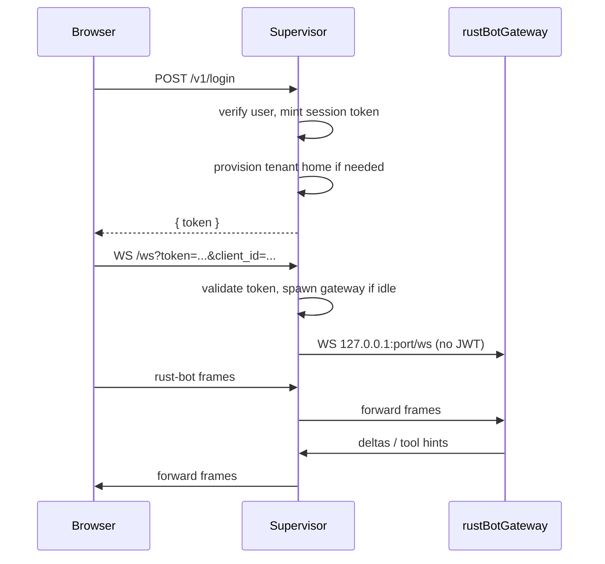

# Supervisor app

New workspace member. **No changes to rust-bot’s agent/config/session core.** rust-bot remains a single-tenant child process.

## Architecture



Public surface matches what [websockets-chat](websockets-chat/src/app.rs) already expects:

- `POST /v1/login` with `{ email, password }` → `{ token }` (same shape as [chat-ui/src/api/mod.rs](chat-ui/src/api/mod.rs))
- `WS /ws?client_id=&token=` — supervisor checks `token`, strips it, opens a client socket to the user’s gateway, and copies text frames both ways

Workers bind `127.0.0.1` only, with `channels.websocket.jwt.enabled: false` (rust-bot default). The browser never talks to a worker port.

## New crate: `supervisor/`

Add a binary crate to the workspace in [Cargo.toml](Cargo.toml) (`members` only; keep `default-members = ["."]` so existing `cargo run -- …` still builds rust-bot).

Do **not** depend on the `rust-bot` library crate (it would pull the whole agent). Own deps: `axum` (WS), `tokio`, `tokio-tungstenite`, `tower-http` (CORS + static files), `serde`/`serde_json`, `jsonwebtoken` + Ed25519 (same mint/validate pattern as [src/security/jwt.rs](src/security/jwt.rs)), `argon2`, `uuid`, `clap`, `chrono`.

Layout:

- `supervisor/src/main.rs` — clap: `serve`, `users add`
- `config.rs` — supervisor.json
- `users.rs` — JSON catalog (email, argon2 hash); login shape compatible with existing UI
- `tenants.rs` — provision `tenants/<id>/` from a template
- `workers.rs` — port pool, spawn/kill, idle timer, concurrency cap
- `proxy.rs` — `/v1/login` + `/ws` pipe + static `websockets-chat` dist
- `auth.rs` — mint/validate supervisor session JWT (`aud` can be `/ws` so the UI can keep putting the token on the query string)

## Supervisor config

`supervisor/supervisor.json` (path via `--config`):

- `listen`: `0.0.0.0:8080`
- `rustBotBin`: path to `rust-bot` (default `rust-bot` on PATH)
- `tenantsDir`: e.g. `./tenants`
- `templateConfig`: path to the tenant config template
- `usersFile`: e.g. `./supervisor/users.json`
- `webRoot`: `./websockets-chat/dist`
- `workerHost`: `127.0.0.1`
- `portRange`: `19000–19039` (40 slots)
- `maxWorkers`: `40`
- `idleTimeoutSecs`: `900` (15 min)
- `spawnTimeoutSecs`: `30`
- JWT key paths for **supervisor** tokens (not rust-bot’s)

## Tenant home

On first successful login, create:

```
tenants/<safe-email>/
  config.json
  workspace/          # rust-bot seeds AGENTS.md etc. on first start
```

Rewrite the template so each worker is isolated:

- `agents.workspace` → that tenant’s `workspace/`
- `gateway.host` → `127.0.0.1`, `gateway.port` → allocated port
- `channels.websocket.path` → `/ws`, `jwt.enabled` → `false`
- `channels.allowFrom` → `["*"]` (localhost-only bind is the real gate)
- `tools.restrictToWorkspace` → `true`
- **MCP:** leave `Authorization` as `${MCP_HEADERS_JWT}` (your choice for v1). Workers inherit the supervisor process env, so all tenants share that placeholder until per-user tokens are added later. Structure the rewrite helper so a future `mcpJwt` field on the user record can replace the header without a redesign.

Spawn:

```
rust-bot gateway --config tenants/<id>/config.json --host 127.0.0.1 --port <p>
```

Do **not** pass `--web-root` to workers. The supervisor serves the UI once.

Ready check: poll TCP connect to `127.0.0.1:<p>` (the gateway has no `/health`; MCP connect is lazy on first message in [src/agent/agent_loop.rs](src/agent/agent_loop.rs)).

## Worker lifecycle

- Map `email → running Child + port + lastActivity`
- On `/ws` upgrade: validate supervisor JWT → ensure worker (reuse or spawn) → tungstenite connect to `ws://127.0.0.1:<p>/ws?client_id=…` (no token) → bidirectional text-frame copy
- Activity: any proxied frame, or an open browser socket, resets `lastActivity`
- Idle: no open proxied sockets **and** `now - lastActivity > idleTimeout` → `kill` child, free port. Tenant dir stays on disk
- Cap: if 40 workers are live, return 503 on new logins/WS until a slot frees
- Shutdown: SIGTERM/Ctrl+C kills all children

Template for websocket must declare `"websocket"` under `channels` or `run_gateway` will not bind ([src/cli/commands.rs](src/cli/commands.rs) `resolve_websocket_channel`). Ship `supervisor/templates/tenant-config.json` cloned from [configs/openai-compat/config_mcp.json](configs/openai-compat/config_mcp.json) plus the websocket block.

## UI

Reuse [websockets-chat](websockets-chat/) as-is for production (same origin: supervisor serves `dist/` and `/v1/login` + `/ws`).

Dev-only: point [websockets-chat/Trunk.toml](websockets-chat/Trunk.toml) login proxy at the supervisor port (not `18790`). Document `?wsBase=ws://<supervisor>/` so the browser WS also hits the supervisor during `trunk serve`.

No new chat app. No rust-bot JWT `purpose: webui` on the worker path.

## User admin

`supervisor users add --email --password --users-file` (argon2id, same idea as [src/api/user_registry.rs](src/api/user_registry.rs)). Enough to load the 231-seat directory; no MCP JWT field in v1.

## Tests (crate-local)

- User register/login verify
- Tenant config rewrite (workspace, host/port, jwt off, websocket path)
- Port allocator (checkout/release, exhaust at 40)
- Idle policy (open socket holds worker; idle kill after timeout)
- WS proxy: mock gateway echo server, assert frames pass and browser `token` is not forwarded

## Out of scope (v1)

- Per-user MCP JWTs (placeholder only)
- Changing rust-bot (`OnceLock` config, in-process multi-tenant, gateway `/health`)
- Rewriting the chat UI
- Horizontal scaling / multiple supervisor hosts
