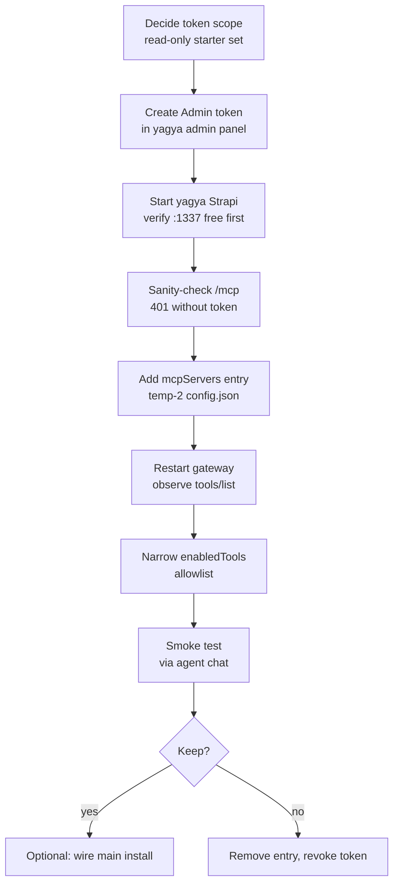

## Flow

## Key facts (verified)

- **Transport**: Strapi's built-in MCP is streamable HTTP at `/mcp`; rust-bot maps `McpTransportType::StreamableHttp` → rmcp `StreamableHttpClientTransport` (src/agent/tools/mcp/mod.rs:346, 369). No code changes needed anywhere.
- **Auth**: Admin token created in the admin panel; sent as `Authorization: Bearer <token>`. Tool visibility is filtered by token permissions at connection time — the token is both auth and scope control.
- **Config target**: `C:\temp\rust-bot-temp-2\.rust-bot\config.json` → `tools.mcpServers` (sisterjayanti-strapi entry is the shape reference: transportType / url / headers / toolTimeout / enabledTools).
- **Tool surface at 5.51.2**: content-management tools only — collection types: list/get/create/update/delete/publish/unpublish/discard_draft; single types: get/write/delete/publish/unpublish/discard_draft. Media Library tools (10) require 5.54.0 — absent here. Dev-mode `log` utility tool is available in development mode only.
- **Scale**: ~40 content types in src/api → at full token permissions, up to ~280 content tools on top of the existing 77 sisterjayanti tools. Current model context window is 131072 tokens — do not connect with an unscoped token + enabledTools ["*"] left in place.

## Decision points (to confirm before execution)

1. **Token scope** — read-only starter set, or full CRUD from day one? Recommendation: read-only first; widen after the plumbing is proven.
2. **Target install** — temp-2 assumed (this session's install). Say so if the main install is the real target.
3. **Content-type starter set** — which ones does rust-bot actually need? Proposal: page, event, speaker, video unless there's a specific use case.
